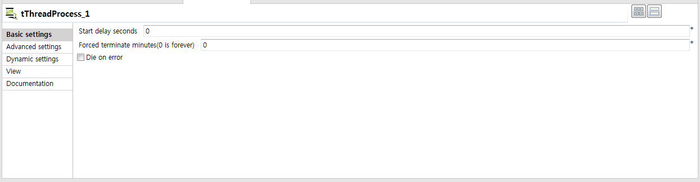
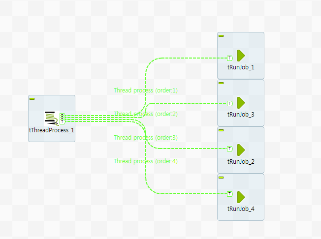
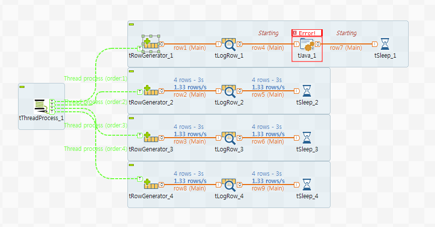

## tThreadProcess

### Overview
This component can make a components process of job to execute like multi-thread process.
Multi-thread process help you to save time of job process and to give flexbility for resource management.
You could be setting start delay seconds and forced timeout minutes.
If you want to terminate on error, you can use the "Die on error" option.
### Details
it's enable a components to execute concurrently.(Parallel components execution)
the configuration of this component can constributes for using resource and running capabilies.

### Images

### Install Instructions
Download actifacts. 
Exetract the component from zip compressed file to temp folder. 
Copy contents of temp folder to TOS components folder where plug-in’s placed. 
And then restart TOS.
Dive into

#### Release Notes

##### 0.90 - 2019-04-16 08:29:41
Release Ver. 0.90
First draft of the component.

### Compatible
 -  6.0 (obsolete)
 -   6.1 (obsolete)
 -   6.2 (obsolete)
 -   6.3 (obsolete)
 -   6.4 (obsolete)
 -  6.5 (retired)
 -  7.0 (retired)
 -  7.1 (retired)