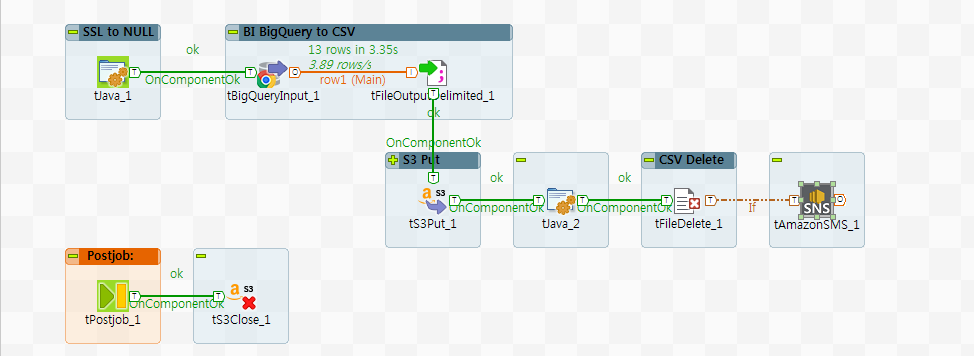
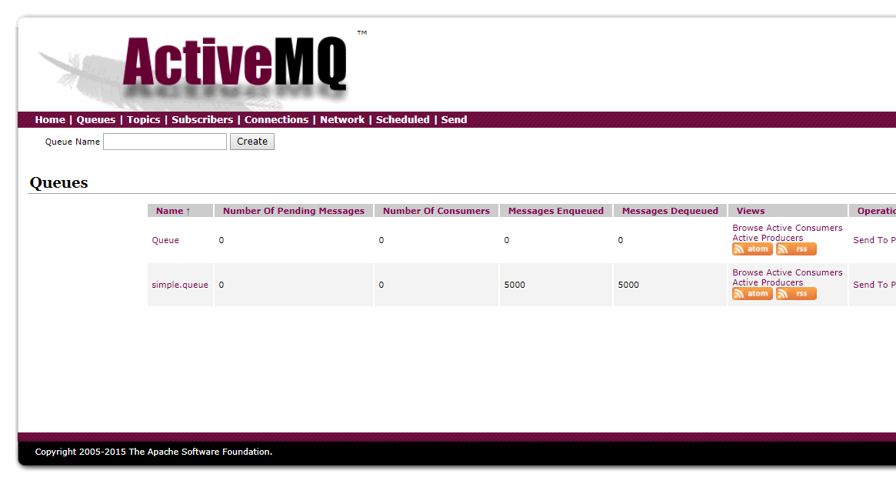
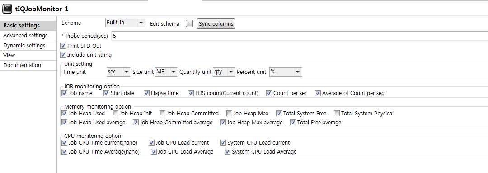
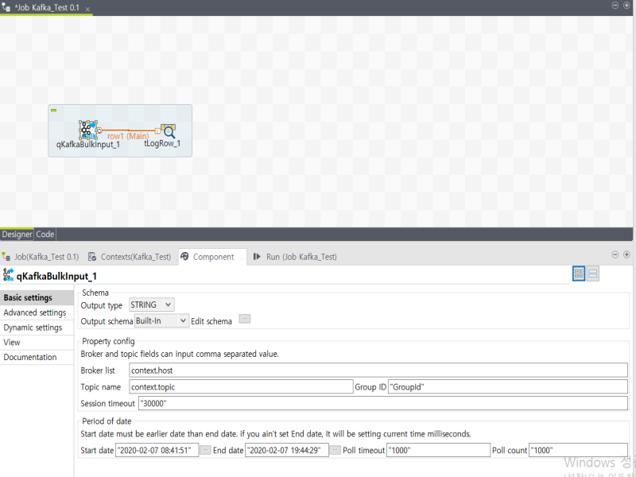
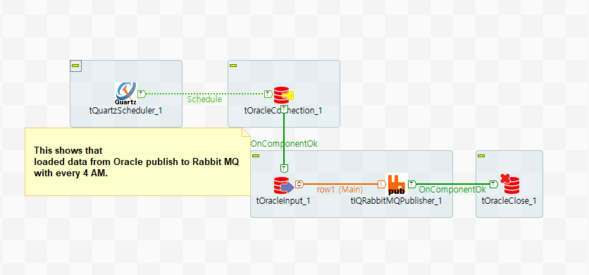
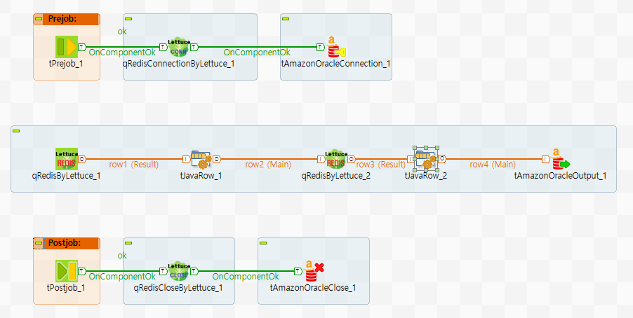

# Kooin-Shin
  Hi all~ 

I am developer of hooking on Talend. My major field of programming is Java that is involving not only developing ETL but also Web, Application, Network developing etc. I imagine that all of developers work with interactive co-working.

I wish good days always be with you :)

     <nospam+chaos930@gmail.com>

## <a href='./components/AmazonSMS/readme.md'> AmazonSMS</a>
 :white_check_mark: Compatible with Talend 7.x / 8.x 

This component offers to send SMS to endpoint someone or other ones.
Based on Amazon SNS service, therefore it is able to using some option by amazon SNS service.

## <a href='./components/Http Components/readme.md'> Http Components</a>
 :white_check_mark: Compatible with Talend 7.x / 8.x 

Http Component Server(HCS) is providing powerful, elastic, well-formed development process to fulfill customer's various requirements that would be serviced with elasticity and efficiency. 
HCS is best alternatives about WEB, WAS or OLTP as mid-light weight server side service and it could to be a part of infrastructure service as Web or WAS which is much spending development time, complicated development, more-risky. 
HCS could be performing as if integrate variety task of server and furthermore, It will provide efficient and elastic service on MSA(Micro Service Architecture) that consists of small separated module.
Because of compling with component based development, Developer can develop service of business in 30 minutes if business specification and SQL querys are perpared.
As HCS is perfactly support to compatibillity of Talend Open Studio(TOS)'s components, Develper can use veriaty components of TOS. This is meaning that can using RDBMS, No-SQL, other storage components of TOS and Also can using On-Premise, Big-Data, Cloud(AWS, Google) components. Basically, it supports with basic compoent of Data process of TOS.
It could be replaced with WAS as Batch or API service. it provides very easy way to build service that drag and drop GUI components and just selecting UI options. 
Because of HCS is provided as TOS components, Existing TOS developer just follow that ways.

## <a href='./components/Kafka Bunch/readme.md'> Kafka Bunch</a>
 :white_check_mark: Compatible with Talend 7.x / 8.x 

This product consist of three component and able to publish/consumer/commit to Kafka server.
tKafkaProducer is able to publish messages to Kafka server and able with various option of Kafka.
tKafKaConsumer is functioning to consume message from Kafka server with the topic and partitions. It can be run to subscribe or assign by option and run like daemon or can be set to terminate option.
tKafkaConsumerCommit is to commit to kafka server with option that sync or async and can be set by specific partition's offset.

## <a href='./components/tActiveMQConsumer/readme.md'> tActiveMQConsumer</a>
 :white_check_mark: Compatible with Talend 7.x / 8.x 

This component contribute to publish ActiveMQ message through Talend job.
You can able to manipulate message with schema-based data process.
You can also control many options for receiving message process and so you can configure proper contition for your system.

## <a href='./components/tActiveMQProducer/readme.md'> tActiveMQProducer</a>
 :white_check_mark: Compatible with Talend 7.x / 8.x 

This component contribute to publish ActiveMQ message through Talend job.
You can able to manipulate schema-based data message that will be publishing to ActiveMQ.
You can also control many options for queue manage and so you can configure proper contition of your architecture.

## <a href='./components/tGTranslator/readme.md'> tGTranslator</a>
 :white_check_mark: Compatible with Talend 7.x / 8.x 

This component contributes to translate text by Gooogle translate API.
You can choose language that will be translated on each column of Schema and you will be obtain translated text.
Also the component supports 64 language to translate.

## <a href='./components/tJobMonitor/readme.md'> tJobMonitor</a>
 :white_check_mark: Compatible with Talend 7.x / 8.x 

This component support that admin will be known infomation of job and system resources by various option, measured value, the numbers.
You can setting various unit and selecting resource options.
This able to setting periodic probe point, measured data unit, and memory & CPU resource of job and system.

## <a href='./components/tKafkaBulkInput/readme.md'> tKafkaBulkInput</a>
 :white_check_mark: Compatible with Talend 7.x / 8.x 

This component provide interval time opertation to process kafka bulk with users.
Basically you can be setting start date and end date on UI input form from component tap. Also if you are needed to set polling timeout and polling count, you can do it.
Normally You have only to input interval of time value. If you need to be set detail configuration of polling, you can configurate that. polling timeout is timeout value per one polling. polling count is polling count. In case of huge data polling process, data could't be fetched at once with single polling and sometimes could be empty. because of this, you can setting this value properly.

## <a href='./components/tQuartzScheduler/readme.md'> tQuartzScheduler</a>
 :white_check_mark: Compatible with Talend 7.x / 8.x 

This component contribute to schedule multiple components process in a Talend job.

This component is bounded on Quartz Scheduler which is mostly used as scheduling working process as open-source library.
you can schedule various working bunch of Talend components by cron expression.
because of this, able to schedule multiple components in one job, It can be used as scheduling server of component groups or sub job.
basically, Talend job is based on single batch process but by using this component, you can create to compose concurrently different scheduled job process.
the scheduler is worked with defining cron expression and the component provide two different ways to define cron expression that is showed on basic setting in Talend Open Studio.

## <a href='./components/tRabbitMQPublisher/readme.md'> tRabbitMQPublisher</a>
 :white_check_mark: Compatible with Talend 7.x / 8.x 

This component contributes to publish message to exchange on RabbitMQ. 
You can also create new exchange and new queue with entered name which is binded with queue and exchange. 
You can configure the appropriate option for exchange and queue like duration, auto-delete, exclusive, routing-key and etc.
It's also able to use arguments for detail operation. If your queue or exchange already exist by RabbitMQ server, you don't need to configure that. 
Message is packed that data of schematic columns will be serialized with header which is specifying length of column data.
Because of using column length header(Integer-4bytes), You don't no more have to use field separator for column.
Each columns is managed by type to support Talend schema type, Therefore you must be complied column type sequence of publisher when you receive data at consumer.
Being to support Talend type, It can able to send object which is Serializable by Java Serializable rule and to send object to consumer.  

If you want to design stream-based architecture which is part of Data-Streamer or DataLake-Synchronizer,
This component is best option for your system.

## <a href='./components/tRabbitMQSubscriber/readme.md'> tRabbitMQSubscriber</a>
 :white_check_mark: Compatible with Talend 7.x / 8.x 

This component can able to subscribe message from RabbitMQ. 
You can edit and apply schema for message to transform data to using of your needs. 
You can set option for constant run, else if you want to wait for continuous enqueue message, otherwise the component terminate when all message of queue be consumed. 
This component just can be used single for consuming message, but It can be using with tRabbitMQPublisher component a pair.
Because of using column length header(Integer-4bytes), You don't no more have to use field separator for column.
Each columns is managed by type to support Talend schema type, Therefore you must be complied column type sequence of publisher.
As supporting Talend type, It can able to receive object which is Serialized by Java Serializable rule.  

If you want to design stream-based architecture which is part of Data-Streamer or DataLake-Synchronizer,
This component is best option for your system.

## <a href='./components/tRedisByLettuce/readme.md'> tRedisByLettuce</a>
 :white_check_mark: Compatible with Talend 7.x / 8.x 

This component set is able to command on Redis server.
You can do Redis command with input schema line or custom commanding. 
Additionally if you choosen script mode, you can compose with Lua script on editor.
Also you can use Connection/Close component saparately.

Output data structure is providing for List type

## <a href='./components/tThreadProcess/readme.md'> tThreadProcess</a>
 :white_check_mark: Compatible with Talend 7.x / 8.x 

This component can make a components process of job to execute like multi-thread process.
Multi-thread process help you to save time of job process and to give flexbility for resource management.
You could be setting start delay seconds and forced timeout minutes.
If you want to terminate on error, you can use the "Die on error" option.

## <a href='./components/tWebCrawler/readme.md'> tWebCrawler</a>
 :white_check_mark: Compatible with Talend 7.x / 8.x 

This component is dedicated for crawling HTML content from website.
you can config that component be needed option field such as "Search Engine", "Crawling URL", "Webpage keyword pattern", "Crawling depth", "Crawling Duration", "Save HTML"... etc in Basic settings.
you can set Advanced setting where, from this tab, you are select varius option to improve tWebCrawler component.
you can connect crawling result to other component as output connection that able to be accepted to process data. Through doing this, you are able to process crawling data for what you need to processing.
During component is running, Crawler component collect web content and deliver content to connected other components.
Output schema setting is able to process what you want to.

Output of crawling schema is involved inforamtion of follows.

URL - crawling URL
KEYWORD - keyword from user
MATCH - match count in content
HTML - collected HTML page
TEXT - extract text from HTML page
COOKIE - cookie of collected HTML
CHARSET - charset of HTML page
FILENAME - filename of HTML
LAST_MODIFIED - lastmodified value of HTML header
CURRENT_DATE - timestamp of time of crawling HTML

