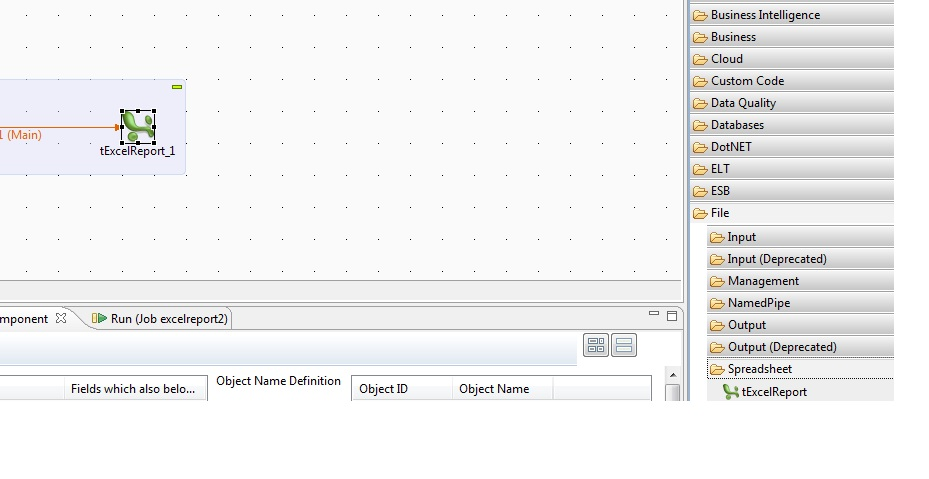

## Latest Excel Reports

### Overview
This component works on excel reports (.xls) extension.

You can find this component under spreadsheet.

This  was create d by hugo but did not work post version 3 , I have reconfigured it for current version.
### Details
http://www.adcdata.co.uk/ExcelReportMan_files/ExcelReport.pdf
### Images

#### Release Notes

##### 5.6.1 - 2015-03-25 09:23:02
Tested for 5.6.1
### Compatible
 -  5.6 (obsolete)
 -   6.0 (obsolete)
 -   6.1 (obsolete)
 -   6.2 (obsolete)