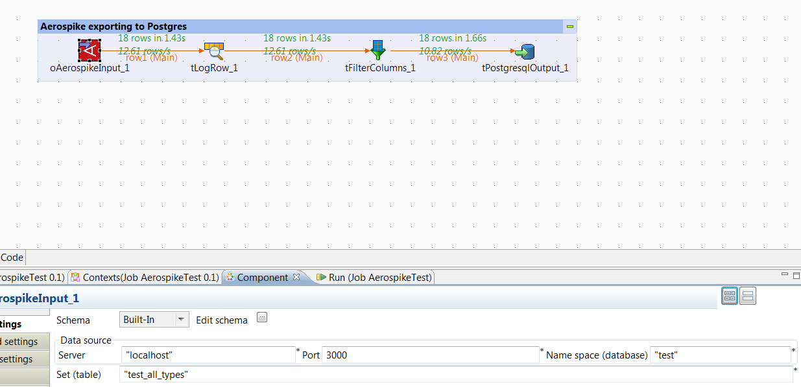
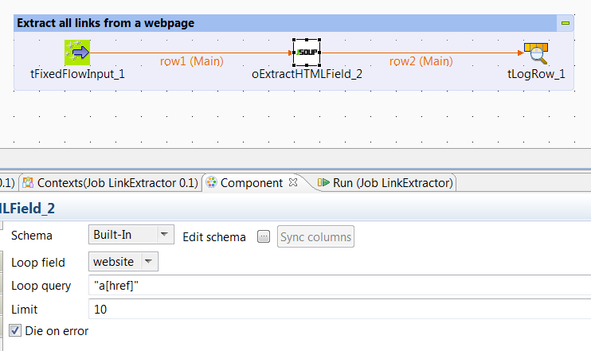

## oExtractHTMLField

### Overview
[OSSCube UK](http://www.osscube.co.uk/) provides 2 Talend components for HTML extraction based on [JSoup](http://jsoup.org/) and an Aerospike component which can be used to extract data from a set (table).
### Details
[OSSCube UK](http://www.osscube.co.uk/)'s components allow direct data extraction from HTML using CSS queries, similar to what you use in JQuery. 

The Aerospike input component allows the extraction of data from Aerospike sets. 
### Images

### Install Instructions
This component should be installable via the Talend Exchange. If you need help with css queries, please check: http://jsoup.org/cookbook/extracting-data/selector-syntax
### Resources
 * <a href=http://www.osscube.co.uk/>OSSCUBE UK</a>
 * <a href=http://www.aerospike.com/>Aerospike</a>

#### Release Notes

##### 0.2 - 2015-04-14 07:36:18
Allows looping through HTML using CSS queries, similar to what you have in jQuery. This component uses internally JSoup.
### Compatible
 -  5.6 (obsolete)
 -   6.0 (obsolete)