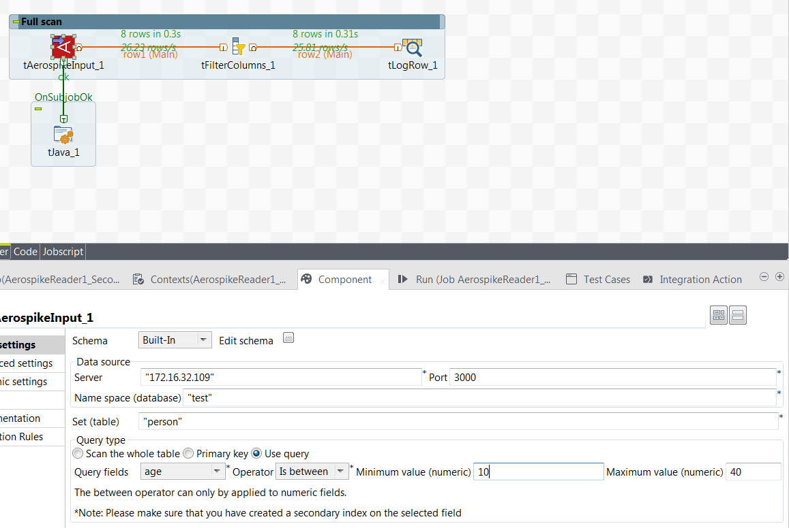
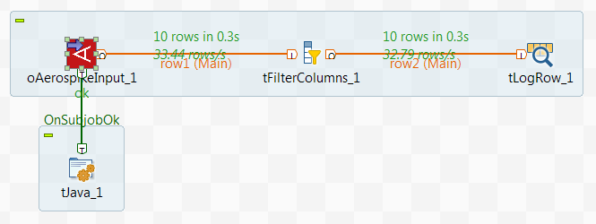

## Aerospike Delete

### Overview
These components are part of a set of components used to interact with Aerospike.
### Details
Our products allow access to Aerospike (write, read, read by key and delete)
### Images

### Install Instructions
Please copy the package to the components folder of Talend Studio. Please note that you will need Aerospike up and running to use this component. For more information on Aerospike, please check http://www.aerospike.com/
### Resources
 * <a href=http://www.onepointltd.com/talend-data-solutions/talend-data-integration/>Onepoint Data Solutions</a>

#### Release Notes

##### 0.1 - 2016-05-05 13:45:24
This component allows to delete Aerospike records by key
### Compatible
 -  6.0 (obsolete)
 -   6.1 (obsolete)
 -   6.2 (obsolete)