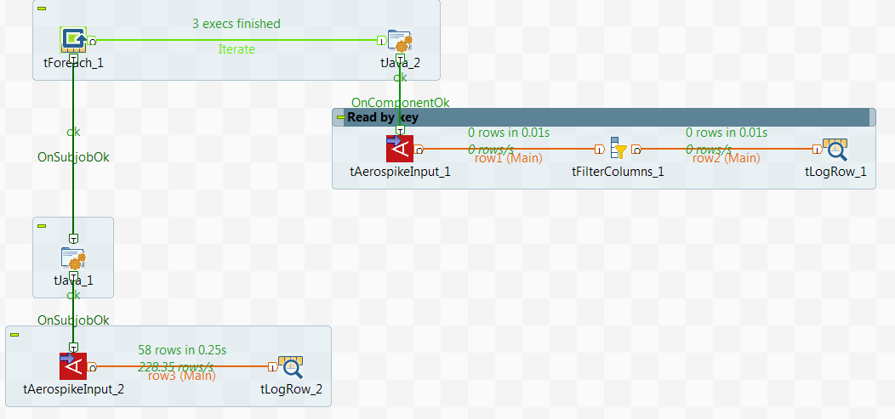

## Aerospike Input

### Overview
These components are part of a set of components used to interact with Aerospike.
### Details
Our products allow access to Aerospike (write, read, read by key and delete)
### Images

### Install Instructions
Aerospike Input can be installed like any other DI component by unzipping the product into the components folder for example. For more information on Aerospike, please visit http://www.aerospike.com/
### Resources
 * <a href=http://www.onepointltd.com/talend-data-solutions/talend-data-integration/>Onepoint Data Solutions</a>

#### Release Notes

##### 0.3 - 2016-05-05 13:45:13
Aerospike Input allows to read data from Aerospike sets. It supports a full scan or a query by primary key.
### Compatible
 -  6.0 (obsolete)
 -   6.1 (obsolete)
 -   6.2 (obsolete)