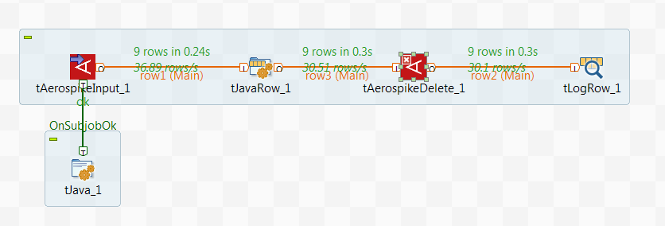
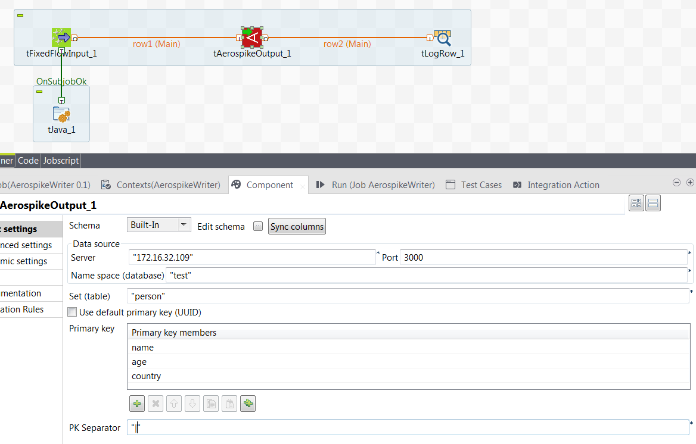

## Aerospike Output

### Overview
These components are part of a set of components used to interact with Aerospike.
### Details
Our products allow access to Aerospike (write, read, read by key and delete)
### Images

### Install Instructions
This is a standard DI component which can be installed by unzipping the package content to the components folder for example. For more information on Aerospike, please visit: http://www.aerospike.com/
### Resources
 * <a href=http://www.onepointltd.com/talend-data-solutions/talend-data-integration/>Onepoint Data Solutions</a>

#### Release Notes

##### 0.1 - 2016-05-05 13:44:54
Aerospike Output allows Talend users to write data to Aerospike sets. It allows the creation of custom keys, based on the fields or simply generates universal unique identifiers for the keys.
### Compatible
 -  6.0 (obsolete)
 -   6.1 (obsolete)
 -   6.2 (obsolete)