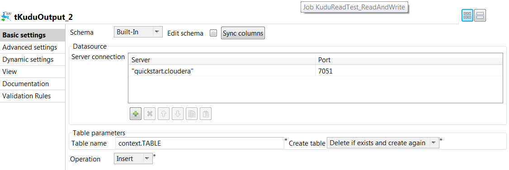

## Kudu Input

### Overview
**Apache Kudu** is a revolutionary new columnar store for Hadoop that enables the powerful combination of fast analytics on fast data. Kudu complements the existing Hadoop storage options, **HDFS** and **Apache HBase**. Additional information on **Apache Kudu**, its architecture and use cases can be found at (http://getkudu.io/).

Onepoint provides two components that enable reading data from and writing data to Kudu which is the first native Hadoop storage engine that supports both low-latency random access and high-throughput analytics. This enables seamless integration between your organization's multiple, heterogeneous data source and Kudu.

### Details
These components enable organization's to create a data pipeline between existing data sources and Kudu thus enabling fast analytics and fast data from sources such as Internet of Things, wearables, machine data among others. They enable all main CRUD operations of Create, Read, Update and delete.

Kudu Output
===========
The Kudu Output component supports table creation operations as well as 4 record based operations: 
-   **create** 
-   **insert**
-   **delete** 
-   **upsert** 
This component also allows detailed error handling when the AUTO_FLUSH mode is turned on.

Kudu Input
==========
The Kudu Input component supports table scanning, but also the usage of an unlimited number of Kudu queries. 
### Images

### Install Instructions
Before installing make sure that you have defined the components folder in your Talend project. Then unzip the file and copy the folder with name tKuduInput to your Talend components folder. After this restart Talend Studio.
### Resources
 * <a href=http://www.onepointltd.com/community-development/>Onepoint Webpage</a>
 * <a href=http://getkudu.io/>Kudu Webpage</a>

#### Release Notes

##### 0.1 - 2016-06-02 16:49:42
The **Kudu Input** component allows users to **scan** or **query** Apache Kudu tables. You can create with this component complex queries with any number of predicates.
##### 0.2 - 2016-11-01 10:32:49
This new version supports Apache Kudu **1.0.1**, even though it should be compatible with versions 1.0 and 0.8.
It comes with a couple of new features:
-   Support for multiple servers
-   Scan timeout support
### Compatible
 -  6.0 (obsolete)
 -   6.1 (obsolete)
 -   6.2 (obsolete)