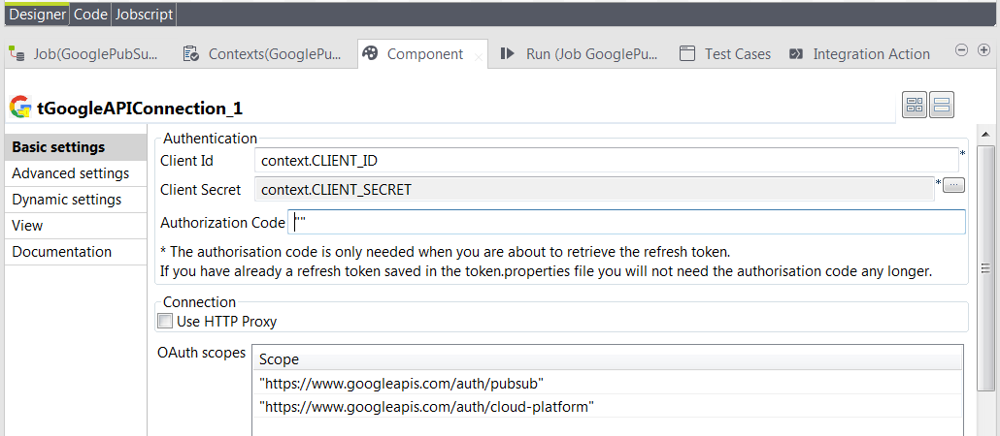
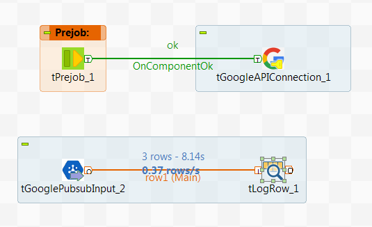

## tGoogleAPIConnection

### Overview
Onepoint support a set of generic Google components which support existing Onepoint components. Components like e.g. the **tGoogleAPIConnection** component are not to be used as standalone components, but together with other Onepoint components, like e.g. **tGooglePubSubInput** or **tGooglePubSubOutput**.
### Details
**tGoogleAPIConnection** is similar to many Talend connection components allowing to share a common resource - in this case the OAUTH2 credentials - with multiple job components. This component will in general terms improve the performance of your jobs. 
### Images

### Install Instructions
Please unpack the provided zip file into the Talend Studio user components folder. After this start or re-start your studio and the components should be available in the palette.

#### Release Notes

##### 0.1 - 2016-09-19 07:10:29
**tGoogleAPIConnection** allows to configure and share the Google OAUTH2 credentials object which can be shared by other Onepoint components like e.g. **tGooglePubSubInput** and **tGooglePubSubOutput**.
### Compatible
 -  6.0 (obsolete)
 -   6.1 (obsolete)
 -   6.2 (obsolete)