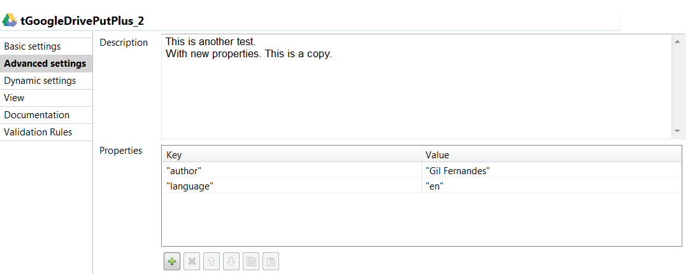
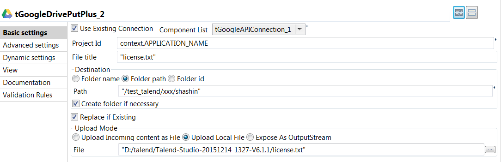
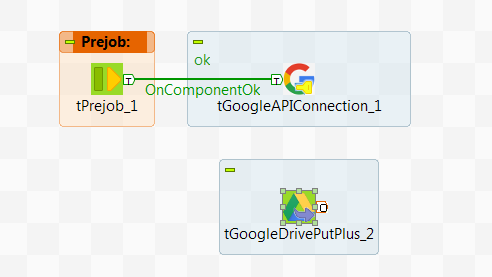

## tGoogleDrivePutPlus

### Overview
One of the main features of all Onepoint Google Drive components is the fact that all components support **Oauth's 2 refresh tokens**. This means that any time you use any of these components a new access token will be generated, based on the refresh token.
Apart from this you will find in this offering tGoogleDrivePut with some features not available in Talend's original components:
-   The tGoogleDrivePut component allows end users to specify the target folder (i.e. the folder to which the file is to be uploaded) by name, path or Google Drive ID
-   The tGoogleDrivePutPlus component supports setting the description field of the target document.
-   tGoogleDrivePutPlus does also support setting any number of document properties.
-   After the file has been uploaded the Google File ID can be retrieved for the uploaded file.
### Details
The Onepoint Google Drive components are a set of components which have a broader range of functions when compared to Talend's native components. The common outstanding feature of all these components is the usage of OAuth'2 refresh token to generate access tokens. This ensures that the end user will not need to generate access tokens manually. All components are able to interact with the **tGoogleAPIConnection** component, which can also be downloaded separately from Talend Exchange.
### Images

### Install Instructions
Before installing make sure that you have defined the components folder in your Talend project. Then unzip the file and copy the folder with name tKuduOutput to your Talend components folder. After this restart Talend Studio.
### Resources
 * <a href=http://www.onepointltd.com/community-development/>Onepoint Community Development</a>

#### Release Notes

##### 0.1 - 2016-11-01 12:34:15
The **tGoogleDrivePutPlus** component is similar to the existing tGoogleDrivePut component (which you can get with Talend 6.x). The common purpose of both components is to upload files to Google Drive. Yet tGoogleDrivePutPlus has some significant features which tGoogleDrivePut does not have:
-   OAuth Refresh token usage
-   The target folder can be specified in three different ways (folder name, folder path, folder id) and will be created in case it does not exists.
-   Supports setting the description field of the target document.
-   Supports setting any number of document properties. 
### Compatible
 -  6.0 (obsolete)
 -   6.1 (obsolete)
 -   6.2 (obsolete)