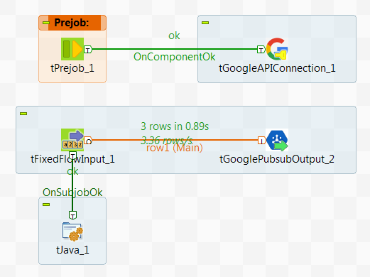

## tGooglePubSubInput

### Overview
**Google Cloud Pub/Sub** brings the scalability, flexibility, and reliability of enterprise message-oriented middleware to the cloud. It is a fully-managed real-time messaging service that allows you to send and receive messages asynchronously between applications, thereby decoupling senders and receivers. It is designed to provide “at least once” delivery at low latency with on-demand scalability to 1 million messages per second (and beyond).

The Onepoint **tGooglePubsubInput** and **tGooglePubsubOutput** components allow Talend developers/integrators to leverage Google's cloud based enterprise message-oriented middleware by enabling data integration jobs to consume and write standard JSON messages from and to this messaging middleware.

The component assumes a correctly configured Google Pub/Sub infrastructure. Please visit: [Google Pub/Sub documentation](https://cloud.google.com/pubsub/overview) for additional information om Google Pub/Sub, its architecture and setup guides.

Note
------

Please note that unlike most DI components the **tGooglePubsubInput** will listen to the incoming messages of a topic and therefore the job will only finish when the user terminates the job.

### Details
Google Cloud Pub/Sub delivers low-latency, durable messaging that helps developers quickly integrate systems hosted on the Google Cloud Platform and externally. This component enables data integration jobs written in Talend to:
*   Listen and consume messages in JSON format from the messaging middleware. 
*   Write messages in JSON format to the messaging middleware.
*   OAuth 2.0 based authentication and authorization
*   Dynamic deletion and creation of topics
*   From version 0.2 both components can share the Google credentials shared in **tGoogleAPIConnection**
### Images

### Install Instructions
Please unpack the provided zip file into the Talend user components folder. Then start or re-start your Talend Studio.
### Resources
 * <a href=http://www.onepointltd.com/community-development/>Onepoint Resource Centre</a>
 * <a href=https://cloud.google.com/pubsub/overview>Google Pub/Sub documentation</a>
 * <a href=http://www.onepointltd.com/>Onepoint Consulting</a>

#### Release Notes

##### 0.1 - 2016-07-08 10:32:49
The Onepoint tGooglePubsubInput component allows Talend DI users to subscribe to Google Pub/Sub topics and receive and process incoming messages using a pre-defined JSON format.
##### 0.2 - 2016-09-19 07:11:13
The new version of the **tGooglePubSubInput** component allows users to share a Onepoint **tGoogleAPIConnection** component. 
### Compatible
 -  6.0 (obsolete)
 -   6.1 (obsolete)
 -   6.2 (obsolete)