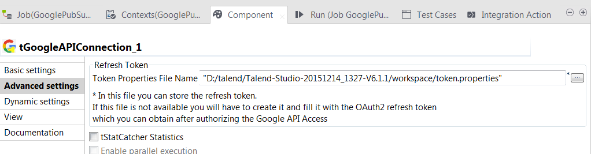

# Onepoint Ltd
  I am a developer working at Onepoint Limited in London with a strong focus on Talend and data driven applications.
     <http://www.onepointltd.com/>
  <nospam+gil.fernandes@onepointltd.com>

## <a href='./components/Aerospike Delete/readme.md'> Aerospike Delete</a>
 :warning: Compatibility not known

These components are part of a set of components used to interact with Aerospike.

## <a href='./components/Aerospike Input/readme.md'> Aerospike Input</a>
 :warning: Compatibility not known

These components are part of a set of components used to interact with Aerospike.

## <a href='./components/Aerospike Output/readme.md'> Aerospike Output</a>
 :warning: Compatibility not known

These components are part of a set of components used to interact with Aerospike.

## <a href='./components/Azure Service Bus Endpoint/readme.md'> Azure Service Bus Endpoint</a>
 :white_check_mark: Compatible with Talend 7.x / 8.x 

Connect to Azure Service Bus

## <a href='./components/Azure Service Bus Output/readme.md'> Azure Service Bus Output</a>
 :white_check_mark: Compatible with Talend 7.x / 8.x 

Connect to Azure Service Bus

## <a href='./components/Kudu Input/readme.md'> Kudu Input</a>
 :warning: Compatibility not known

**Apache Kudu** is a revolutionary new columnar store for Hadoop that enables the powerful combination of fast analytics on fast data. Kudu complements the existing Hadoop storage options, **HDFS** and **Apache HBase**. Additional information on **Apache Kudu**, its architecture and use cases can be found at (http://getkudu.io/).

Onepoint provides two components that enable reading data from and writing data to Kudu which is the first native Hadoop storage engine that supports both low-latency random access and high-throughput analytics. This enables seamless integration between your organization's multiple, heterogeneous data source and Kudu.

## <a href='./components/Kudu Output/readme.md'> Kudu Output</a>
 :warning: Compatibility not known

**Apache Kudu** is a revolutionary new columnar store for Hadoop that enables the powerful combination of fast analytics on fast data. Kudu complements the existing Hadoop storage options, **HDFS** and **Apache HBase**. Additional information on **Apache Kudu**, its architecture and use cases can be found at (http://getkudu.io/).

Onepoint provides two components that enable reading data from and writing data to Kudu which is the first native Hadoop storage engine that supports both low-latency random access and high-throughput analytics. This enables seamless integration between your organization's multiple, heterogeneous data source and Kudu.

## <a href='./components/tGoogleAPIConnection/readme.md'> tGoogleAPIConnection</a>
 :warning: Compatibility not known

Onepoint support a set of generic Google components which support existing Onepoint components. Components like e.g. the **tGoogleAPIConnection** component are not to be used as standalone components, but together with other Onepoint components, like e.g. **tGooglePubSubInput** or **tGooglePubSubOutput**.

## <a href='./components/tGoogleDrivePutPlus/readme.md'> tGoogleDrivePutPlus</a>
 :warning: Compatibility not known

One of the main features of all Onepoint Google Drive components is the fact that all components support **Oauth's 2 refresh tokens**. This means that any time you use any of these components a new access token will be generated, based on the refresh token.
Apart from this you will find in this offering tGoogleDrivePut with some features not available in Talend's original components:
-   The tGoogleDrivePut component allows end users to specify the target folder (i.e. the folder to which the file is to be uploaded) by name, path or Google Drive ID
-   The tGoogleDrivePutPlus component supports setting the description field of the target document.
-   tGoogleDrivePutPlus does also support setting any number of document properties.
-   After the file has been uploaded the Google File ID can be retrieved for the uploaded file.

## <a href='./components/tGooglePubSubInput/readme.md'> tGooglePubSubInput</a>
 :warning: Compatibility not known

**Google Cloud Pub/Sub** brings the scalability, flexibility, and reliability of enterprise message-oriented middleware to the cloud. It is a fully-managed real-time messaging service that allows you to send and receive messages asynchronously between applications, thereby decoupling senders and receivers. It is designed to provide “at least once” delivery at low latency with on-demand scalability to 1 million messages per second (and beyond).

The Onepoint **tGooglePubsubInput** and **tGooglePubsubOutput** components allow Talend developers/integrators to leverage Google's cloud based enterprise message-oriented middleware by enabling data integration jobs to consume and write standard JSON messages from and to this messaging middleware.

The component assumes a correctly configured Google Pub/Sub infrastructure. Please visit: [Google Pub/Sub documentation](https://cloud.google.com/pubsub/overview) for additional information om Google Pub/Sub, its architecture and setup guides.

Note
------

Please note that unlike most DI components the **tGooglePubsubInput** will listen to the incoming messages of a topic and therefore the job will only finish when the user terminates the job.

## <a href='./components/tGooglePubsubOutput/readme.md'> tGooglePubsubOutput</a>
 :warning: Compatibility not known

**Google Cloud Pub/Sub** brings the scalability, flexibility, and reliability of enterprise message-oriented middleware to the cloud. It is a fully-managed real-time messaging service that allows you to send and receive messages asynchronously between applications, thereby decoupling senders and receivers. It is designed to provide “at least once” delivery at low latency with on-demand scalability to 1 million messages per second (and beyond).

The Onepoint **tGooglePubsubInput** and **tGooglePubsubOutput** components allow Talend developers/integrators to leverage Google's cloud based enterprise message-oriented middleware by enabling data integration jobs to consume and write standard JSON messages from and to this messaging middleware.

The component assumes a correctly configured Google Pub/Sub infrastructure. Please visit: [Google Pub/Sub documentation](https://cloud.google.com/pubsub/overview) for additional information om Google Pub/Sub, its architecture and setup guides.

Note
------

Please note that unlike most DI components the **tGooglePubsubInput** will listen to the incoming messages of a topic and therefore the job will only finish when the user terminates the job.

