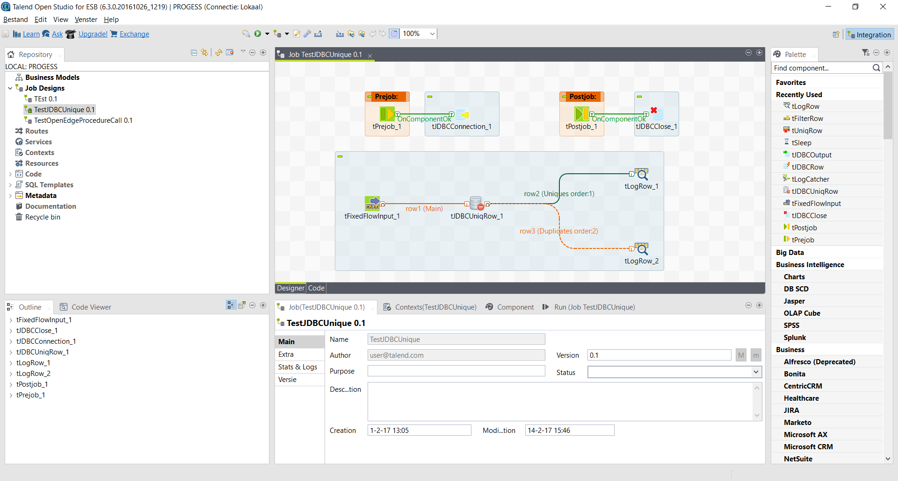
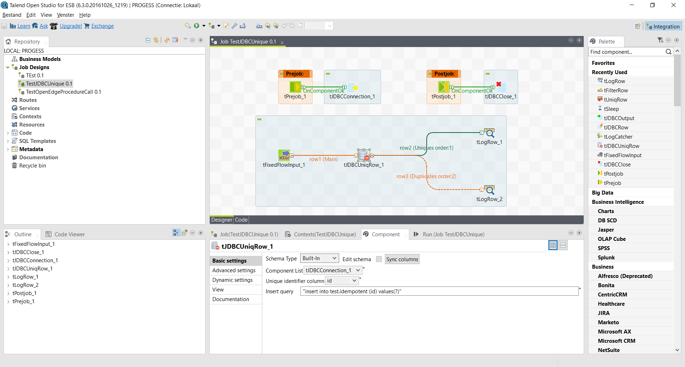

## tJDBCUniqRow

### Overview
Check out the wiki page at https://github.com/rjptegelaar/tJDBCUniqRow/wiki
### Details
Process rows on several servers without having to worry about duplicates.
### Images

### Install Instructions
Check out the wiki at https://github.com/rjptegelaar/tJDBCUniqRow/wiki/Configuration
### Resources
 * <a href=https://github.com/rjptegelaar/tJDBCUniqRow/wiki>WIKI</a>
 * <a href=https://github.com/rjptegelaar/tJDBCUniqRow/issues>Issues</a>

#### Release Notes

##### 1.0.1 - 2017-02-21 05:29:02
See github page at https://github.com/rjptegelaar/tJDBCUniqRow
##### 1.0.2 - 2017-03-29 11:16:18
See github page at https://github.com/rjptegelaar/tJDBCUniqRow
##### 1.0.3 - 2018-12-31 12:37:57
See github page at https://github.com/rjptegelaar/tJDBCUniqRow
### Compatible
 -  6.0 (obsolete)
 -   6.1 (obsolete)
 -   6.2 (obsolete)
 -   6.3 (obsolete)
 -   6.4 (obsolete)
 -  6.5 (retired)
 -  7.0 (retired)