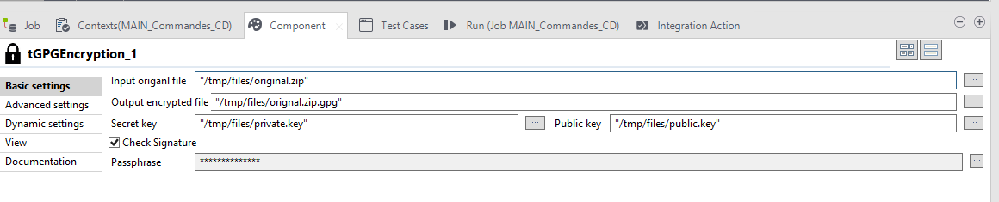

## tPGPEncrypt

### Overview
Component to encrypt file with PGP. You can use certificate or only passphrase
### Details
Transfer and store your file in security
### Images

### Install Instructions
Install in custom components directory

#### Release Notes

##### 1.0 - NULL
Encrypt your file with PGP
### Compatible
 -  6.3 (obsolete)
 -   6.4 (obsolete)
 -  6.5 (retired)
 -  7.0 (retired)