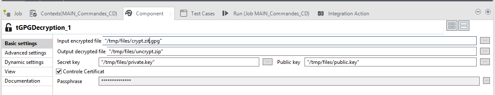

# Pierre Coste
  <http://dummy.com>
  <nospam+pierre.coste@keyrus.com>

## <a href='./components/tPGPDecryption/readme.md'> tPGPDecryption</a>
 :white_check_mark: Compatible with Talend 7.x / 8.x 

A product for decrypt PGP file

## <a href='./components/tPGPEncrypt/readme.md'> tPGPEncrypt</a>
 :white_check_mark: Compatible with Talend 7.x / 8.x 

Component to encrypt file with PGP. You can use certificate or only passphrase

