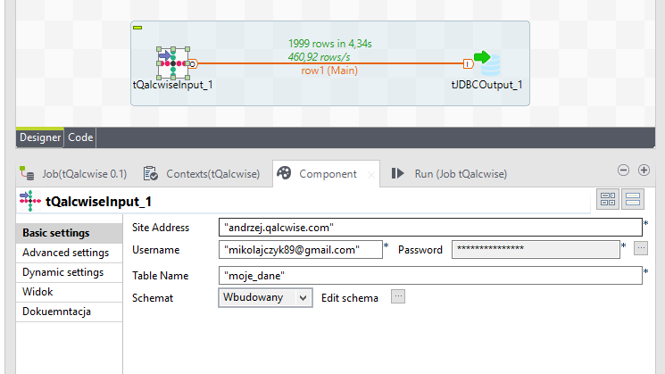

## tQalcwiseInput

### Overview
Component loads data from Qalcwise table.

Only site address, user credentials and source table name required.

Whole table content is loaded (currently no row filtering is supported).
### Images

#### Release Notes

##### 0.3 - NULL

### Compatible
 -  6.3 (obsolete)