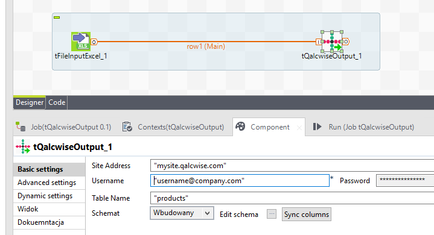

## tQalcwiseOutput

### Overview
Component loads data into Qalcwise table.

Only site address, user credentials and destination table name required.

Column mappings can be done by editing schema.

### Images

#### Release Notes

##### 0.2 - NULL

### Compatible
 -  6.3 (obsolete)