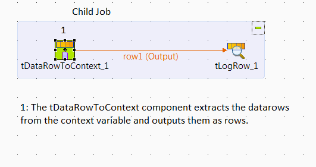
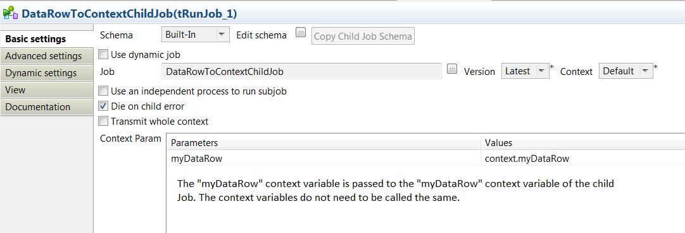
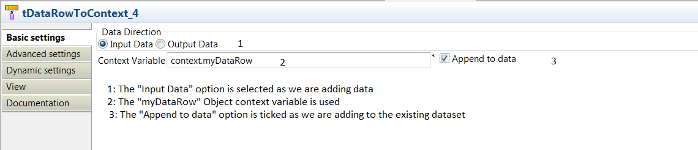
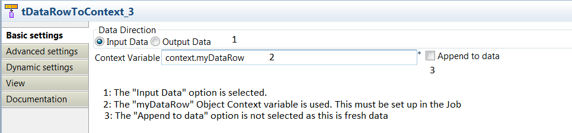

## tDataRowToContext

### Overview
The tDataRowToContext allows you to store a set of datarows in an Object context variable. This allows sets of data to be stored within a Job (like the tHash components), but also allows those datarows to be passed between Jobs.  
### Details
Sometimes you need to send multiple datarows between Jobs. While it is easy to send datarows from Child to Parent Jobs, there is no way (without coding) of sending datarows to Child Jobs. This component allows this and also allows you to treat a set of datarows in the same way you would treat Context variables, opening up a whole new range of ways to manipulate your data.
### Images

#### Release Notes

##### 0.1 - 2015-06-07 18:38:46
The tDataRowToContext component allows you to collect datarows in an Object context variable, and store them to be used later inside a Job or pass them to a child Job to be used in that Job.
This is version 0.1 and is in testing. Please send details of issues or requested improvements to admin@rilhia.com.
This component has revealed a problem with how Talend handles memory when passing large context variables between Jobs. The Jira case for that issue is here (https://jira.talendforge.org/browse/TDI-32753). 
### Compatible
 -  5.0 (obsolete)
 -   5.1 (obsolete)
 -   5.2 (obsolete)
 -   5.3 (obsolete)
 -   5.4 (obsolete)
 -   5.5 (obsolete)
 -   5.6 (obsolete)