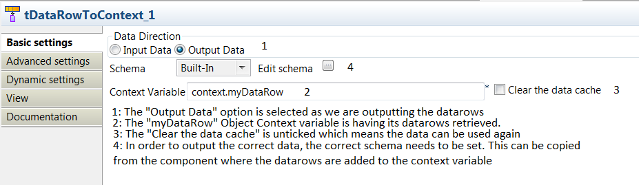

# Rilhia Solutions Limited
  <www.rilhia.com>
  <nospam+admin@rilhia.com>

## <a href='./components/tDataRowToContext/readme.md'> tDataRowToContext</a>
 :warning: Compatibility not known

The tDataRowToContext allows you to store a set of datarows in an Object context variable. This allows sets of data to be stored within a Job (like the tHash components), but also allows those datarows to be passed between Jobs.  

