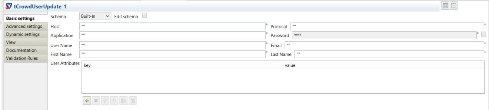

## tCrowdUserUpdate

### Overview
Component used to update user information into Atlassian Crowd
### Details
Component used to update user information into Atlassian Crowd including option to delete/insert new user attributes
### Images

### Install Instructions
Unzip file in to component directory and add directory to Talend Components 

#### Release Notes

##### 1.0.0 - 2016-11-30 08:23:50
Custom component used for update the particular details in Atlassian Crowd including user attributes
### Compatible
 -  5.5 (obsolete)
 -   5.6 (obsolete)
 -   6.0 (obsolete)
 -   6.1 (obsolete)
 -   6.2 (obsolete)