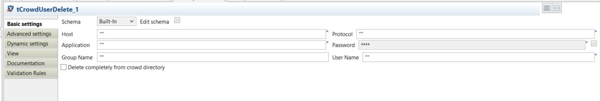
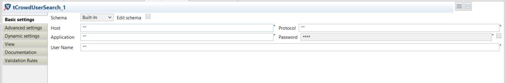

# albintbaby
  <nospam+albintbaby@gmail.com>

## <a href='./components/tCrowdUserDelete/readme.md'> tCrowdUserDelete</a>
 :warning: Compatibility not known

Component for delete user details from Atlassian Crowd

## <a href='./components/tCrowdUserInput/readme.md'> tCrowdUserInput</a>
 :warning: Compatibility not known

Component used for insert user details into Atlassian Crowd

## <a href='./components/tCrowdUserOutput/readme.md'> tCrowdUserOutput</a>
 :warning: Compatibility not known

Component used for get user details from Atlassian Crowd based on Application and Group

## <a href='./components/tCrowdUserSearch/readme.md'> tCrowdUserSearch</a>
 :warning: Compatibility not known

Component used for search user information inside Atlassian Crowd

## <a href='./components/tCrowdUserUpdate/readme.md'> tCrowdUserUpdate</a>
 :warning: Compatibility not known

Component used to update user information into Atlassian Crowd

