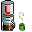

# bcourtine
  <http://blog.courtine.org/>
  <nospam+contact@courtine.org>

## <a href='./components/bcFileListExt/readme.md'> bcFileListExt</a>
 :warning: Compatibility not known

Evolution of Talend's original tFileList component :
- optimization of generated java code
- exclude file mask is now a table where several filemasks can be excluded at the same time
- even if a file matches more than one filemask, it is sent only once in the "iterate" link to be processed
- file and folder advanced sort options
     - folders before or after files in the iterate link
     - file sort by name, size, or modification date, ascending or descending order in the iterate link

## <a href='./components/bcFileOutputOOSpreadsheet/readme.md'> bcFileOutputOOSpreadsheet</a>
 :warning: Compatibility not known

Output component in OpenOffice 3.x native format (ODS).

This component uses the ODFDOM library.

## <a href='./components/bcFileOutputSQL/readme.md'> bcFileOutputSQL</a>
 :warning: Compatibility not known

This component reads the input data and write to the output file the corresponding SQL script.

## <a href='./components/bcFileProperties/readme.md'> bcFileProperties</a>
 :warning: Compatibility not known

This components based on tFileProperties gives more information : file owner, file permissions, etc.

WARNING: this new information comes from the Java 7 NIO2 API. So, this component only works in a Java 7 environment.

## <a href='./components/bcLDAPAttributesInput/readme.md'> bcLDAPAttributesInput</a>
 :warning: Compatibility not known

This component is an extension of bcLDAPInputExt :

As the bcLDAPInputExt component, this component will do a research in a LDAP server. But in addition to attribute values (defined in the component schema), for each LDAP object, there are theses information :

- objectclass : list of object classes
- mandatoryattributes : list of mandatory attributes for theses classes
- optionalattributes : list of optional attributes for theses classes
- objectattributes : list of attributes that are really valuated for the current object (at least mandatory attributes)

This component requires the courtinessl library provided in bcLDAPInputExt component.

## <a href='./components/bcLDAPInputExt/readme.md'> bcLDAPInputExt</a>
 :warning: Compatibility not known

Extension of Talend tLDAPInput (3.2.3).

This extension add the following features :
- in LDAPS and TLS mode, a password can be provided to open the certificate file
- in LDAPS and TLS mode, certificate validation can be desactivated (all certs are accepted).

This extension needs the "courtinessl" jar (included) which is an evolution of "talendssl".

## <a href='./components/bcLDAPOutputExt/readme.md'> bcLDAPOutputExt</a>
 :warning: Compatibility not known

Extension of Talend tLDAPOutput (3.2.3).

This extension add the following features :
- in TLS mode, a password can be provided to open the certificate file
- in LDAPS and TLS mode, certificate validation can be desactivated (all certs are accepted).

This extension needs the "courtinessl" jar (included in bcLDAPInputExt) which is an evolution of "talendssl".

This component was developed for this usecase :
- when creating a user in Active Directory server, the password can be set ONLY IF the connection is secured. The Active Directory was an internal "auto-certified" server.

## <a href='./components/bcLogback/readme.md'> bcLogback</a>
 :warning: Compatibility not known

This component allows to use the Logback API (using the SLF4J API) to log messages, with the specified log level.

One message is logged by input line. Schema data can be used in the log message.

Note: this component uses the SLF4J API, and no Logback class are direcly used. So, the component can be used with every other logging Framework supported by SLF4J: you just need to replace Logback jar files in the job classpath.

## <a href='./components/bcLogbackCatch/readme.md'> bcLogbackCatch</a>
 :warning: Compatibility not known

Redirect the Talend logs (from "tLogCatcher" component) to the Logback logging Framework, with the original log level.

Since fatal log level is not supported by Logback, fatal logs are converted into error logs.

Component required libraries are provided in the "bclogback" component.

Note: this component uses the SLF4J API, and no Logback class are direcly used. So, the component can be used with every other logging Framework supported by SLF4J: you just need to replace Logback jar files in the job classpath.

## <a href='./components/bcLogbackConfig/readme.md'> bcLogbackConfig</a>
 :warning: Compatibility not known

This component allows to configure the Logback logging Framework with an external XML config file.

If the file doesn't exist or can't be correctly parsed, this component can throw an exception to stop the job.

Required libraries are provided in the "bcLogback" component.

## <a href='./components/bcOAIIdentifiersInput/readme.md'> bcOAIIdentifiersInput</a>
 :warning: Compatibility not known

Read the identifiers that can be processed on a OAI server.

If the result is partial, the resume token is automatically processed until all responses are read.

Requested libraries are provided in "bcOAIRecordsInput" component.

## <a href='./components/bcOAIIdentifyInput/readme.md'> bcOAIIdentifyInput</a>
 :warning: Compatibility not known

Read the OAI server identification.

Requested libraries are provided in "bcOAIRecordsInput" component.

## <a href='./components/bcOAIMetadatasInput/readme.md'> bcOAIMetadatasInput</a>
 :warning: Compatibility not known

Read the metadata formats managed by an OAI server.

Requested libraries are provided in "bcOAIRecordsInput" component.

## <a href='./components/bcOAIRecordInput/readme.md'> bcOAIRecordInput</a>
 :warning: Compatibility not known

Read a specific OAI record, for a given identifier.

Requested libraries are provided in "bcOAIRecordsInput" component.

## <a href='./components/bcOAIRecordsInput/readme.md'> bcOAIRecordsInput</a>
 :warning: Compatibility not known

Read a list of records from an OAI server.

If the list is partial, resume token is automatically managed until all records are read.

## <a href='./components/bcOAISetsInput/readme.md'> bcOAISetsInput</a>
 :warning: Compatibility not known

Read the available sets from an OAI server.

If the response is partial, the resume token is automatically managed until all sets are read.

Requested libraries are provided in "bcOAIRecordsInput" component.

## <a href='./components/bcResourceInputProperties/readme.md'> bcResourceInputProperties</a>
 :warning: Compatibility not known

This component is derivated from tFileInputProperties.

The input properties or ini file is read from Java resources instead of a physical file. This resource file must be in the classpath (in a directory or a jar file included in the classpath).

I use this component to load a job context without specifying the input file location. When I launch the job, I just add the file location in the classpath.

## <a href='./components/tBufferCopyInput/readme.md'> tBufferCopyInput</a>
 :warning: Compatibility not known

With original Talend tBufferInput component, it is not possible to make in the same subjob a chain "tBufferInput > ... > tBufferOutput", since these two components use the same globalBuffer list.

This tBufferCopyInput makes a copy of the globalBuffer list, and reads data rows from this copy. After that, the tBufferOutput can write data rows in the global buffer without memory exception.

So a chain "tBufferCopyInput > ... > tBufferOutput" works fine.

After making a copy of the global buffer, it is possible to clear it, in order to allow the tBufferOutput component to write data rows in an empty buffer.

## <a href='./components/tBufferOutput/readme.md'> tBufferOutput</a>
 :warning: Compatibility not known

Output buffer

Evolution of Talend's original tBufferOutput component in order to add a "empty global buffer" checkbox.

If checked, the buffer will be cleared before adding data rows. So, several couples "tOutputBuffer/tInputBuffer" can be used in the same job.

Warning : DO NOT use chains "tInputBuffer => ... => tOutputBuffer" in your jobs. There will be a MemoryException. You can do that chain with the tBufferCopyInput component.

Warning : the "clean option" of this component is executed in the begin jet template. So, chronologicaly, it will be the first thing done in the subjob.
So, in a chain "tBufferCopyInput => ... => tOutputBuffer", to get a clean output buffer before writing data, you MUST use the tBufferCopyInput clean option.

## <a href='./components/tFileDigester/readme.md'> tFileDigester</a>
 :warning: Compatibility not known

Checksum of a file, obtained with the Java MessageDigest.

With a Sun JRE 6, theses digest method are supported :
- MD2
- MD5
- SHA-1
- SHA-256
- SHA-384
- SHA-512

With other JRE versions, you can get a runtime "NoSuchAlgorithmException".

## <a href='./components/tInformixCommit/readme.md'> tInformixCommit</a>
 :warning: Compatibility not known

Informix commit

Not existing in origanal Informix components. 
Must use with an existing tInformixConnection.

This component has been added to TOS 4.0.0+. So it is now supported on Talend bugtracker.

## <a href='./components/tInformixConnection/readme.md'> tInformixConnection</a>
 :warning: Compatibility not known

Informix Database SQL connexion

Implement Informix transaction in Talend Job.

Not existing in origanal Informix components. 

Can be used with tInformixInput, tInformixOutput, tInformixRow, tInformixCommit, tInformixRollBack.

This component has been added to TOS 4.0.0+. So it is now supported on Talend bugtracker.

## <a href='./components/tInformixInput/readme.md'> tInformixInput</a>
 :warning: Compatibility not known

Informix Database SQL input

Evolution of Talend's original tInformixInput component in order to use Informix in transactionnal mode with the tInformixConnection, tInformixCommit and tInformixRollback components.

This component has been improved and added to TOS 4.0.0+. So it is now supported on Talend bugtracker.

## <a href='./components/tInformixOutput/readme.md'> tInformixOutput</a>
 :warning: Compatibility not known

Informix Database SQL output

Evolution of Talend's original tInformixOutput component in order to use Informix in transactionnal mode with the tInformixConnection, tInformixCommit and tInformixRollback components.

Warning : this component is built using a skeleton in main JET template, whose path is relative. So, it MUST be placed in the "plugins/org.talend.designer.components.localprovider_VERSION/components" folder. If not, the component template won't compile !

This component has been improved and added to TOS 4.0.0+. So it is now supported on Talend bugtracker.

## <a href='./components/tInformixRollback/readme.md'> tInformixRollback</a>
 :warning: Compatibility not known

Informix rollback

Not existing in original Informix components. 

Must use with an existing tInformixConnection.

This component has been added to TOS 4.0.0+. So it is now supported on Talend bugtracker.

## <a href='./components/tInformixRow/readme.md'> tInformixRow</a>
 :warning: Compatibility not known

Informix Database SQL row

Evolution of Talend's original tInformixRow component in order to use Informix in transactionnal mode with the tInformixConnection, tInformixCommit and tInformixRollback components.

This component has been added to TOS 4.0.0+. So it is now supported on Talend bugtracker.

## <a href='./components/tInformixSP/readme.md'> tInformixSP</a>
 :warning: Compatibility not known

Informix stored procedure

This component allows to use Informix stored procedures and functions.

Not existing in origanal Informix components. 

Can be used with an existing tInformixConnection.

This component has been improved and added to TOS 4.0.0+. So it is now supported on Talend bugtracker.

## <a href='./components/tInitLog4J/readme.md'> tInitLog4J</a>
 :warning: Compatibility not known

This component is a rewriting of David Robin's InitLog4J component for Talend 3.1+ version.

This development was sponsored by French Health Ministry.

It has the following features :
- xml and properties configuration files are both supported
- a "lock configuration" checkbox allows to lock configuration (to avoid a configuration reset in a subjob, for example)
- a "die on error" checkbox allows to exit job if configuration file does not exist

## <a href='./components/tLog4J/readme.md'> tLog4J</a>
 :warning: Compatibility not known

This component is a rewriting of David Robin's Log4J component for Talend 3.1+ version.

This development was sponsored by French Health Ministry.

This component has the following features :
- by default, the Logger is the class logger > "Logger.getLogger(this.getClass());"
- a specific named logger can be choosen instead of the default logger
- 6 log levels : trace, debug, info, warning, error, fatal
- flow informations can be used in the log message

## <a href='./components/tLog4JCatch/readme.md'> tLog4JCatch</a>
 :warning: Compatibility not known

Log4J interceptor for Talend native logs.

This component is a variation of tLog4J, with theses differences :
- the schema is the same as the "tLogCatcher" component and is not editable
- the log level is dynamic, based on the "priority" of Talend log message

Talend native logs will be sent to Log4J with their original log level.

Use case : a log can be sent to Log4J by Talend using the native "tWarn" component.

## <a href='./components/tRunJob2/readme.md'> tRunJob2</a>
 :warning: Compatibility not known

This component is a variation of the tRunJob component.

In the original tRunJob component, you can get the child job output (with a tBufferOutput component in the child job), but you can't send data rows to the child job.

As the original tRunJob component, context parameters can be sent to the child job.

This tRunJob2 component does the contrary : you can send data rows to the child job (with a tBufferOutput in the parent job, and a tBufferInput in the child job), but you can't get data from the child job.

User manual :
1) In the parent job, send data rows to a tOutputBuffer component : They will be automatically copied in the globalBuffer of the child job
2) In the child job, use a tInputBuffer to get theses data rows

See the screenshot for an example.

DEPRECATED COMPONENT : consider using the tRunJobRow component instead.

## <a href='./components/tRunJobRow/readme.md'> tRunJobRow</a>
 :warning: Compatibility not known

This component was created to run another job, sending to the subjob data rows, and getting back result rows :

- input and output schemas of the subjob can be different (technically, the tRunJobRow component has only an output schema)
- input and output row line numbers can be different

To work fine, this component NEEDS the tBufferCopyInput component.

User manual and explanations :
1) In the main job, data rows are sent to a tBufferOutput
2) In the subjob, data rows are read with a tBufferCopyInput. This component also cleans the global buffer for the next tBufferOutput
3) In the subjob, output data rows are sent to a tBufferOutput

See the screenshot for a real example.

