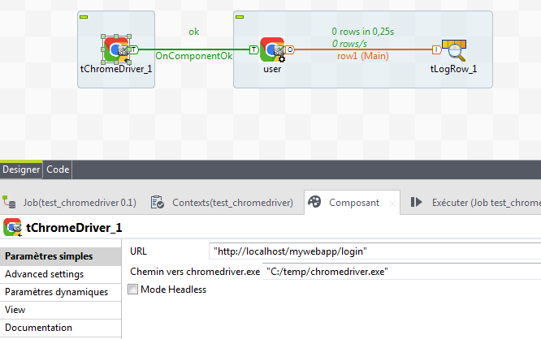

## tChromeDriver

### Overview
This is the web driver from selenium to Chrome browser 
### Images

### Install Instructions
Please use Chrome V78 and copy chromedriver.exe into the directory of your choice.

#### Release Notes

##### 0.1 - 2019-11-26 13:01:22
This Componenent allow you to connect Selelium to Chrome Browser
### Compatible
 - 6.5 (retired)
 -  7.0 (retired)
 -  7.1 (retired)
 - 7.2