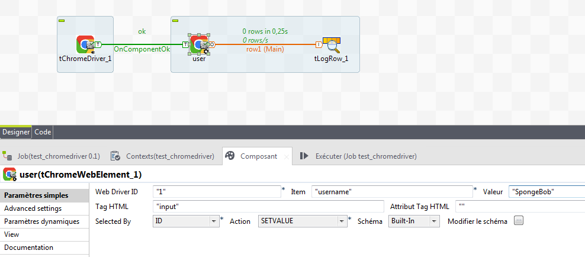

## tChromeWebElement

### Overview
Please feed tChromeDriver number to this component before to use it.
### Images

### Install Instructions
Please feed tChromeDriver number to this componenet before to use it.

#### Release Notes

##### 0.2 - 2019-12-12 13:49:53
This release fixes the click bug on WebElement.
##### 0.3 - 2021-12-28 10:49:58
This version manage xpath expressions like : span[contains(text(),'atext')] and span[contains(@class,'aClassName')]
##### 0.1 - NULL
This component allow you to control any elements into webpage
### Compatible
 - 6.5 (retired)
 -  7.0 (retired)
 -  7.1 (retired)
 - 7.2