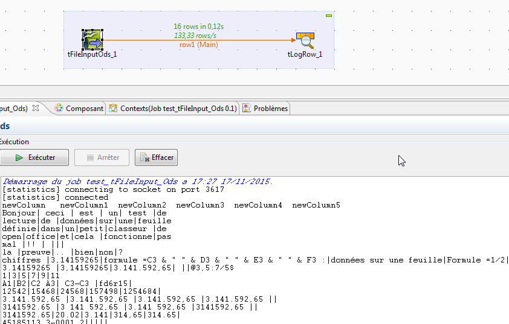

## tFileInputOds

### Overview
tFileInputOds allow you to select a .ods file from OpenOffice calc and read data sheet of your choice.
### Images

### Resources
 * <a href=http://www.jopendocument.org/>jOpenDocument</a>

#### Release Notes

##### 0.1 - 2015-11-17 16:47:08

##### 0.2 - 2017-04-26 11:00:24
This version allow you to retreive hyperText links from OOo Calc sheets 
##### 0.3 - 2018-06-14 07:38:18
This component version 0.3 allows you to define a Header and a Footer and choose sheet(s) incoming by five diffents ways : by the exact datasheet name(ex:"Sheet1"), by a keyword in the datasheet name(ex: "eet" to select "Sheet1","Sheet2" and "Sheet3"), by the datasheet number(ex:  "2" to select "Sheet3"), by the datasheet between numbers I&N where I<N (ex: "2&4" to select "Sheet3" to "Sheet5"), by the datasheet distincts numbers (ex: "0;4;6" to select "Sheet1" ; "Sheet5" ; "Sheet7") .

##### 0.4 - 2018-06-27 07:54:41
This version fixed allows you to iterate reading for the same or another one spreadsheet .ods
### Compatible
 -  4.0 (obsolete)
 -   4.1 (obsolete)
 -   4.2 (obsolete)
 -   5.0 (obsolete)
 -   5.1 (obsolete)
 -   5.2 (obsolete)
 -   5.3 (obsolete)
 -   5.4 (obsolete)
 -   5.5 (obsolete)
 -   5.6 (obsolete)
 -   6.0 (obsolete)
 -   6.1 (obsolete)
 -   6.2 (obsolete)
 -   6.3 (obsolete)
 -   6.4 (obsolete)
 -  6.5 (retired)
 -  7.0 (retired)