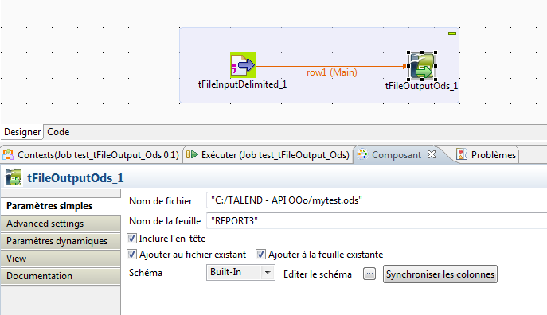

## tFileOutputOds

### Overview
tFileOutputOds allow you to create a sheet or write in append on existing sheet into a .ods OpenOffice Calc file. It Use jOpenDocument1.3.jar.
### Images

### Resources
 * <a href=http://www.jopendocument.org/>jopendocument</a>

#### Release Notes

##### v0.1 - 2015-11-12 15:18:01

##### 0.2 - 2015-11-17 16:39:03
Just a better columns format management
##### 0.3 - 2015-12-15 09:31:44

### Compatible
 -  1.1 (obsolete)
 -   2.0 (obsolete)
 -   2.1 (obsolete)
 -   2.2 (obsolete)
 -   2.3 (obsolete)
 -   2.4 (obsolete)
 -   3.0 (obsolete)
 -   3.1 (obsolete)
 -   3.2 (obsolete)
 -   4.0 (obsolete)
 -   4.1 (obsolete)
 -   4.2 (obsolete)
 -   5.0 (obsolete)
 -   5.1 (obsolete)
 -   5.2 (obsolete)
 -   5.3 (obsolete)
 -   5.4 (obsolete)
 -   5.5 (obsolete)
 -   5.6 (obsolete)
 -   1.2 (obsolete)
 -   6.0 (obsolete)
 -   6.1 (obsolete)
 -   6.2 (obsolete)