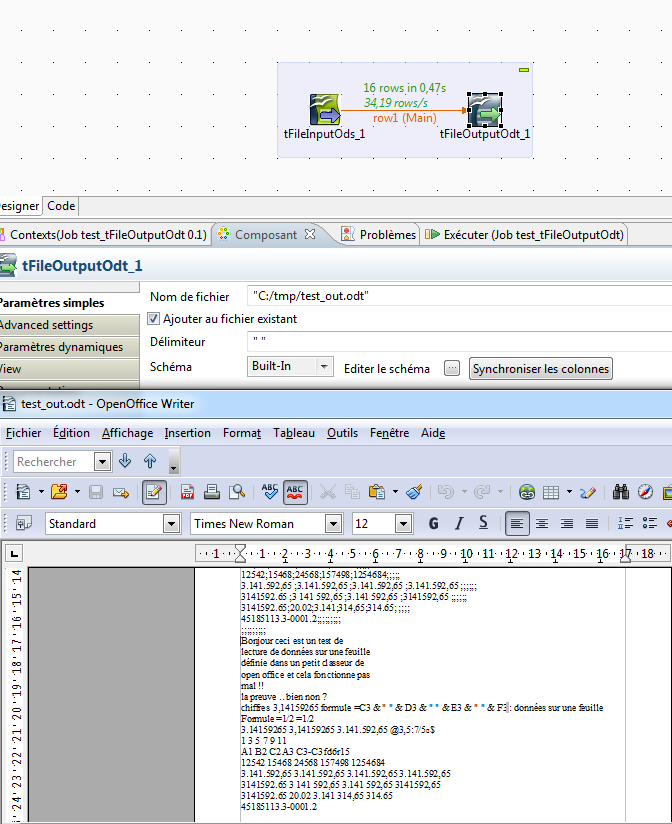

## tFileOutputOdt

### Overview
This Component require odfdom-java-0.8.7.jar and xercesImpl.jar
### Images

### Resources
 * <a href=https://incubator.apache.org/odftoolkit/odfdom/>odfdom</a>

#### Release Notes

##### 0.1 - 2015-12-14 15:01:28

### Compatible
 -  1.1 (obsolete)
 -   2.0 (obsolete)
 -   2.1 (obsolete)
 -   2.2 (obsolete)
 -   2.3 (obsolete)
 -   2.4 (obsolete)
 -   3.0 (obsolete)
 -   3.1 (obsolete)
 -   3.2 (obsolete)
 -   4.0 (obsolete)
 -   4.1 (obsolete)
 -   4.2 (obsolete)
 -   5.0 (obsolete)
 -   5.1 (obsolete)
 -   5.2 (obsolete)
 -   5.3 (obsolete)
 -   5.4 (obsolete)
 -   5.5 (obsolete)
 -   5.6 (obsolete)
 -   1.2 (obsolete)
 -   6.0 (obsolete)
 -   6.1 (obsolete)
 -   6.2 (obsolete)