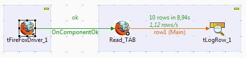

## tFireFoxWebElement

### Overview
This component allow you clic element, set/get value , get table, switch frame on a web page. It only work with tFireFowDriver component ID on a same design.
### Images

### Install Instructions
This version allows you to use select/option and tables html tags.

#### Release Notes

##### 0.1 - 2015-08-25 09:39:54
This component allow you to select by ID, NAME, XPATH, TEXTLINK, FRAME, the elements in html page for Setting/Getting a value, Getting Table or Click on seleted element . It use selenium module on FireFox Web Browser and it only work with tFireFoxDriver ID on a same Design.
##### 0.2 - 2015-08-27 15:43:46
This version catch NoSuchElementException.
##### 0.3 - 2015-08-31 13:26:11
This component allow you clic element, set/get value , get table, switch frame on a web page. It only work with tFireFowDriver component ID on a same design.This version improve GETVALUE case with .getAttribute("value") or .getText() ;
##### 0.4 - 2018-02-20 07:37:24
This component allows you to use selenium3.9.1 with fireFox v55+ with selemenium IDE module to testing web pages.
##### 0.5 - 2018-04-06 14:24:36
This version allows you to use select/option and tables html tags.
### Compatible
 -  6.3 (obsolete)