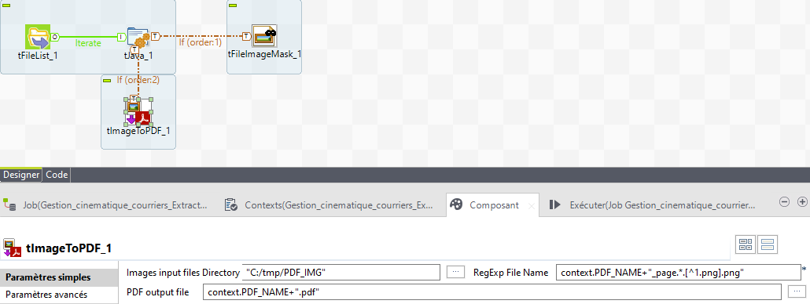

## tImageToPDF

### Overview
this component create .pdf from images , it use itextpdf.jar
### Details
This component allow you to select with reg exp some .png in a directory to create a .pdf
### Images

### Install Instructions
Copy and unzip component into your TOS_DI_<version>\\plugins\\org.talend.designer.components.localprovider_<version>.<date>_xxxx\\components directory

#### Release Notes

##### v0.1 - 2021-06-14 07:50:35
v0.1 This component allow you to select by java reg exp some .png in a directrory to create a .pdf
### Compatible
 -  1.1 (obsolete)
 -   2.0 (obsolete)
 -   2.1 (obsolete)
 -   2.2 (obsolete)
 -   2.3 (obsolete)
 -   2.4 (obsolete)
 -   3.0 (obsolete)
 -   3.1 (obsolete)
 -   3.2 (obsolete)
 -   4.0 (obsolete)
 -   4.1 (obsolete)
 -   4.2 (obsolete)
 -   5.0 (obsolete)
 -   5.1 (obsolete)
 -   5.2 (obsolete)
 -   5.3 (obsolete)
 -   5.4 (obsolete)
 -   5.5 (obsolete)
 -   5.6 (obsolete)
 -   1.2 (obsolete)
 -   6.0 (obsolete)
 -   6.1 (obsolete)
 -   6.2 (obsolete)
 -   6.3 (obsolete)
 -   6.4 (obsolete)
 -  6.5 (retired)
 -  7.0 (retired)
 -  7.1 (retired)
 - 7.2
 - 7.3
 - 1.x