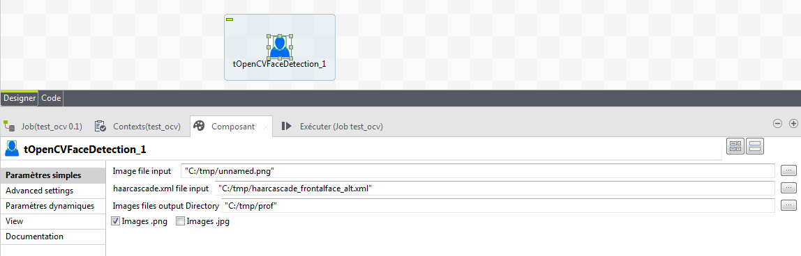

## tOpenCVFaceDetection

### Overview
This component allows you to detect faces in a .png or .jpg file and to extract an image by face in a .png or .jpg file. Just paste in your libs_path opencv_java2413.dll or libopencv_java2413.so
### Details
https://opencv.org/ 
### Images

### Resources
 * <a href=https://opencv.org/>OpenCV</a>

#### Release Notes

##### 0.1 - 2018-07-05 07:31:16
This component allows you to detect faces in a .png or .jpg file and to extract an image by face in a .png or .jpg file.  Just paste in your libs_path opencv_java2413.dll or libopencv_java2413.so 
### Compatible
 -  6.0 (obsolete)
 -   6.1 (obsolete)
 -   6.2 (obsolete)
 -   6.3 (obsolete)
 -   6.4 (obsolete)
 -  6.5 (retired)
 -  7.0 (retired)