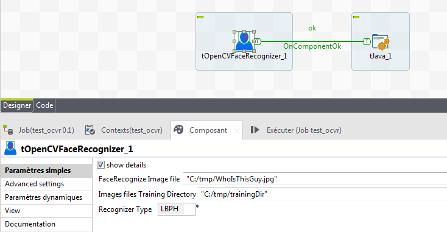

## tOpenCVFaceRecognizer

### Overview
original source from @author Petter Christian Bjelland
### Images

### Resources
 * <a href=https://opencv.org>Opencv</a>

#### Release Notes

##### 0.1 - 2018-07-17 14:01:54
This component allows you to identify a face from .jpg or .png file. Just use globalMap.get("tOpenCVFaceRecognizer_1_FACE") to get named file matching in the training directory.
### Compatible
 -  6.0 (obsolete)
 -   6.1 (obsolete)
 -   6.2 (obsolete)
 -   6.3 (obsolete)
 -   6.4 (obsolete)
 -  6.5 (retired)
 -  7.0 (retired)