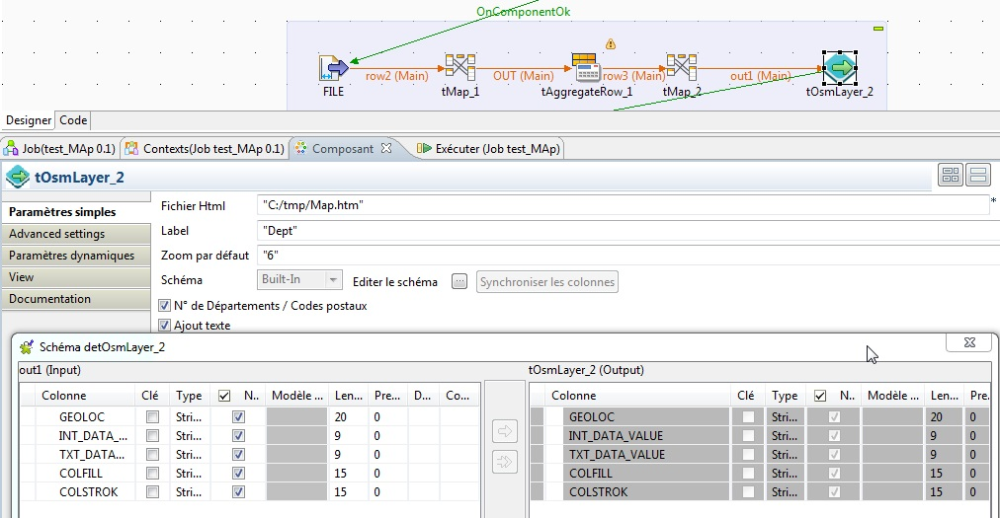

## tOsmLayer

### Overview
This component allow you to generate a .html/javascript OpenLayers file which providing a map with geolocalized circles and labels. 
It contains each geolocalisation long/latt from France departments and cities by zIP codes . 
### Details
This component allow you to generate a .html/javascript OpenLayers file which providing a map with geolocalized circles and labels. 
It contains each geolocalisation long/latt from France departments and cities by zIP codes . 
### Images

### Resources
 * <a href=Openlayers.org>Openlayers.org</a>

#### Release Notes

##### 0.2 - 2019-01-09 09:52:20
This version include colored French departements or markers from leafletjs.
### Compatible
 -  1.1 (obsolete)
 -   2.0 (obsolete)
 -   2.1 (obsolete)
 -   2.2 (obsolete)
 -   2.3 (obsolete)
 -   2.4 (obsolete)
 -   3.0 (obsolete)
 -   3.1 (obsolete)
 -   3.2 (obsolete)
 -   4.0 (obsolete)
 -   4.1 (obsolete)
 -   4.2 (obsolete)
 -   5.0 (obsolete)
 -   5.1 (obsolete)
 -   5.2 (obsolete)
 -   5.3 (obsolete)
 -   5.4 (obsolete)
 -   5.5 (obsolete)
 -   5.6 (obsolete)
 -   1.2 (obsolete)
 -   6.0 (obsolete)
 -   6.1 (obsolete)
 -   6.2 (obsolete)
 -   6.3 (obsolete)
 -   6.4 (obsolete)
 -  6.5 (retired)
 -  7.0 (retired)