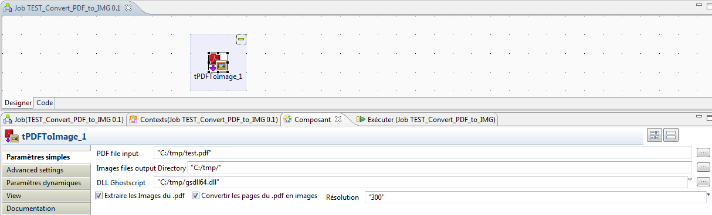

## tPDFToImage

### Overview
This component use by jna.library.path a ghostscript dll GNU avaliable on https://ghostscript.com/download/gsdnld.html
### Images

### Install Instructions
donwload the gsdll64.dll to use with the component.
### Resources
 * <a href=http://www.ghost4j.org/>ghost4j</a>
 * <a href=https://ghostscript.com/download/gsdnld.html>ghostscript</a>
 * <a href=https://pdfbox.apache.org/>pdfbox</a>

#### Release Notes

##### 0.1 - 2017-02-07 11:39:56

##### 0.2 - 2017-02-09 12:17:53
This version just fixed the page number > 0
##### 0.3 - 2017-10-09 15:12:57
This version give you the choice between .png and .tiff images files
##### 0.4 - 2018-07-03 10:23:32
This version 0.4 allows you to convert .pdf in .jpg 
##### 0.5 - 2021-02-23 11:22:24
This version 0.5 allow you to convert pdf to tiff group 4. 
### Compatible
 -7.2
 - 7.3