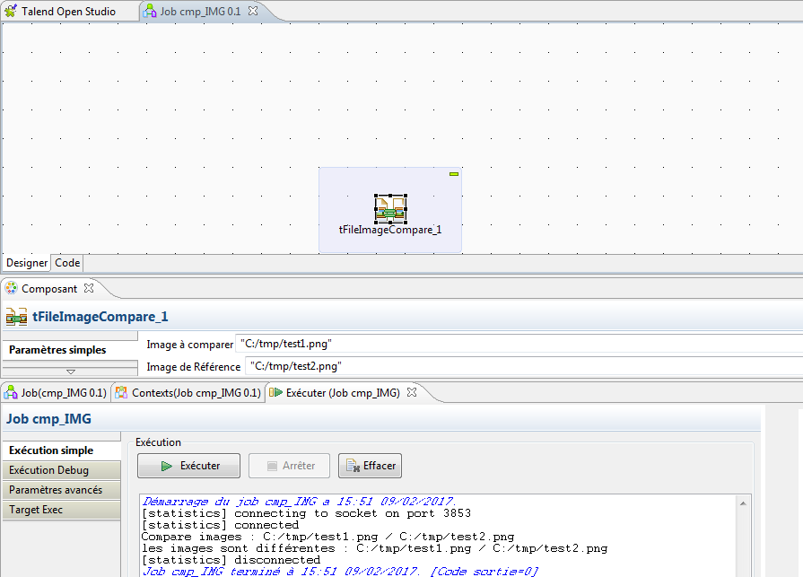
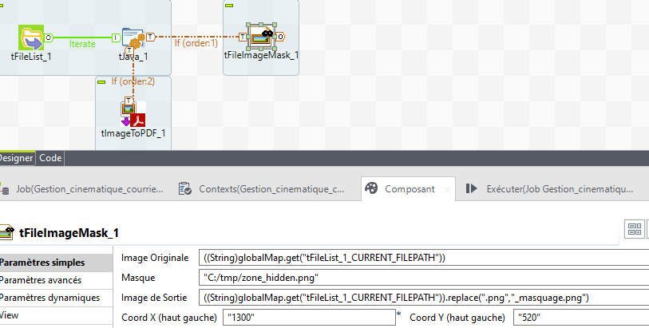
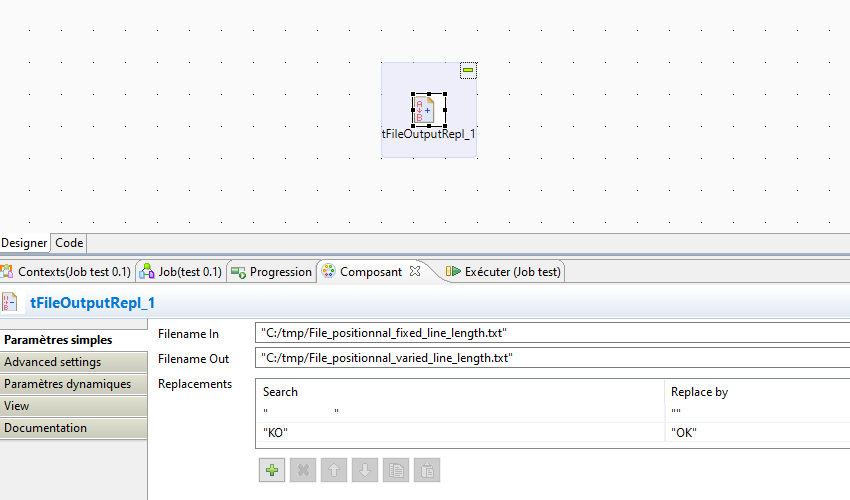
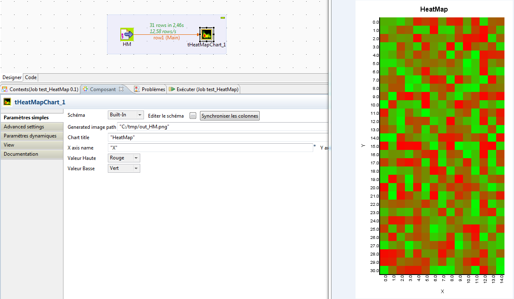
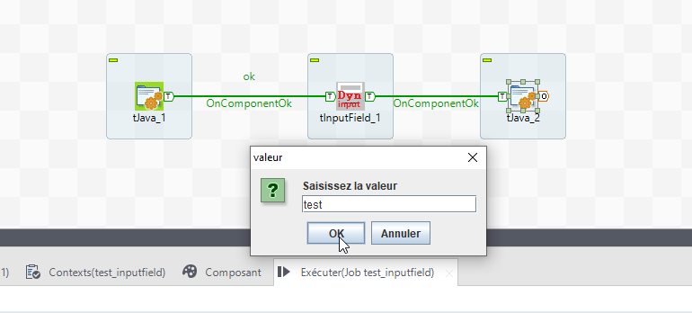
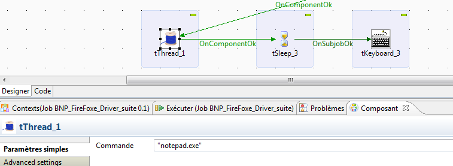
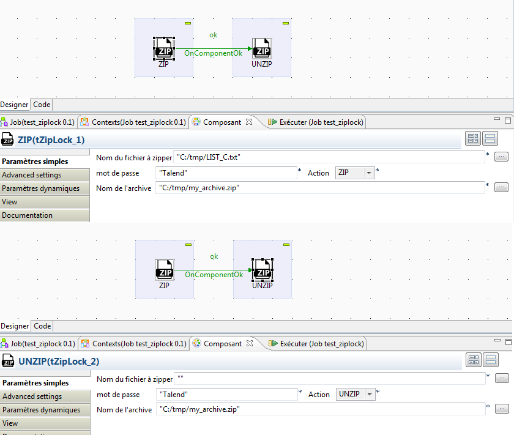

# bennatigiuliano
  <nospam+lbennati.mgiuliano@gmail.com>

## <a href='./components/tBase64/readme.md'> tBase64</a>
 :warning: Compatibility not known

This component allows you to encode/decode distinctly each dataset columns by base64 scheme

## <a href='./components/tBluetoothOutput/readme.md'> tBluetoothOutput</a>
 :warning: Compatibility not known

This component allow you to send a .txt file to devices from an Bluetooth USB key plugged into PC.

## <a href='./components/tBluetoothSearch/readme.md'> tBluetoothSearch</a>
 :warning: Compatibility not known

This component allows you to search device from an USB Bluetooth key.

## <a href='./components/tChromeDriver/readme.md'> tChromeDriver</a>
 :white_check_mark: Compatible with Talend 7.x / 8.x 

This is the web driver from selenium to Chrome browser 

## <a href='./components/tChromeWebElement/readme.md'> tChromeWebElement</a>
 :white_check_mark: Compatible with Talend 7.x / 8.x 

Please feed tChromeDriver number to this component before to use it.

## <a href='./components/tComboBoxDyn/readme.md'> tComboBoxDyn</a>
 :warning: Compatibility not known

## <a href='./components/tFileImageCompare/readme.md'> tFileImageCompare</a>
 :white_check_mark: Compatible with Talend 7.x / 8.x 

This component allow you to compare two images with same resolution and format to generate a new one which containing the differences.

## <a href='./components/tFileImageMask/readme.md'> tFileImageMask</a>
 :white_check_mark: Compatible with Talend 7.x / 8.x 

This component allow you to hide a zone on .png

## <a href='./components/tFileInputItem/readme.md'> tFileInputItem</a>
 :warning: Compatibility not known

This component allows you to read the comments entered in the project metadata  directory. It providing to you the way to obtain some headers columns labels more explicit than the technicals names proposed by default  with the checkboxes   header include  on files outputs components.

## <a href='./components/tFileInputOdb/readme.md'> tFileInputOdb</a>
 :warning: Compatibility not known

This component allows you to read a SQL tables on OpenOffice.org database files (.odb)

## <a href='./components/tFileInputOds/readme.md'> tFileInputOds</a>
 :white_check_mark: Compatible with Talend 7.x / 8.x 

tFileInputOds allow you to select a .ods file from OpenOffice calc and read data sheet of your choice.

## <a href='./components/tFileInputQrcode/readme.md'> tFileInputQrcode</a>
 :warning: Compatibility not known

This component allows you to read Qrcode .jpg .png .gif files  

## <a href='./components/tFileOutputBarCode/readme.md'> tFileOutputBarCode</a>
 :white_check_mark: Compatible with Talend 7.x / 8.x 

https://barcode-coder.com/fr/barcode-classes-java-pour-creer-des-code-barres-204.html

## <a href='./components/tFileOutputOCR/readme.md'> tFileOutputOCR</a>
 :warning: Compatibility not known

This component based on Tesjeract allow you to convert any pictures containing text to .txt file

## <a href='./components/tFileOutputOdb/readme.md'> tFileOutputOdb</a>
 :warning: Compatibility not known

This component allows you to execute an Insert into SQL tables on OpenOffice.org database files (.odb) Adding of functionnalities : Update/Delete based on keys columns to define Sql Where clauses, + a cleaning function when .odb file is corrupted by a Sql error.

## <a href='./components/tFileOutputOds/readme.md'> tFileOutputOds</a>
 :warning: Compatibility not known

tFileOutputOds allow you to create a sheet or write in append on existing sheet into a .ods OpenOffice Calc file. It Use jOpenDocument1.3.jar.

## <a href='./components/tFileOutputOdt/readme.md'> tFileOutputOdt</a>
 :warning: Compatibility not known

This Component require odfdom-java-0.8.7.jar and xercesImpl.jar

## <a href='./components/tFileOutputQrcode/readme.md'> tFileOutputQrcode</a>
 :warning: Compatibility not known

This component allows you to create 2D Qrcode .png .jpg .gif files from a text string

## <a href='./components/tFileOutputRepl/readme.md'> tFileOutputRepl</a>
 :white_check_mark: Compatible with Talend 7.x / 8.x 

## <a href='./components/tFileSplit/readme.md'> tFileSplit</a>
 :white_check_mark: Compatible with Talend 7.x / 8.x 

This component allows you to split a big file which will potentially the cause of a java heap out of memory by N numbered files in a output directory.

## <a href='./components/tFilterColumnsParam/readme.md'> tFilterColumnsParam</a>
 :warning: Compatibility not known

This component allow you to filter columns names + filtering on a dynamic column's name.
Simply use a context.variable to select dynamicaly the column name you need to have in outgoing. 

## <a href='./components/tFireFoxDriver/readme.md'> tFireFoxDriver</a>
 :white_check_mark: Compatible with Talend 7.x / 8.x 

This component allow you to connect to Selenium IDE module on FireFox browser 

## <a href='./components/tFireFoxWebElement/readme.md'> tFireFoxWebElement</a>
 :warning: Compatibility not known

This component allow you clic element, set/get value , get table, switch frame on a web page. It only work with tFireFowDriver component ID on a same design.

## <a href='./components/tFTPJes/readme.md'> tFTPJes</a>
 :warning: Compatibility not known

This component allows you to perform a submit on MVS JCL via Jes-FTP

## <a href='./components/tGanttChart/readme.md'> tGanttChart</a>
 :white_check_mark: Compatible with Talend 7.x / 8.x 

This component allows you to generate a Gantt Graph.

## <a href='./components/tHeatMapChart/readme.md'> tHeatMapChart</a>
 :warning: Compatibility not known

This component use jheatchart-0.6.jar.

## <a href='./components/tImageToPDF/readme.md'> tImageToPDF</a>
 :white_check_mark: Compatible with Talend 7.x / 8.x 

this component create .pdf from images , it use itextpdf.jar

## <a href='./components/tInputField/readme.md'> tInputField</a>
 :white_check_mark: Compatible with Talend 7.x / 8.x 

This component allow you to feed a text field to send variable value into your job when it running.

## <a href='./components/tKeyboard/readme.md'> tKeyboard</a>
 :warning: Compatibility not known

This component allows you to simulate a keyboard.

## <a href='./components/tMouseClick/readme.md'> tMouseClick</a>
 :warning: Compatibility not known

This component allow you to drive a mouse click automated on position you choose

## <a href='./components/tOpenCVFaceDetection/readme.md'> tOpenCVFaceDetection</a>
 :white_check_mark: Compatible with Talend 7.x / 8.x 

This component allows you to detect faces in a .png or .jpg file and to extract an image by face in a .png or .jpg file. Just paste in your libs_path opencv_java2413.dll or libopencv_java2413.so

## <a href='./components/tOpenCVFaceRecognizer/readme.md'> tOpenCVFaceRecognizer</a>
 :white_check_mark: Compatible with Talend 7.x / 8.x 

original source from @author Petter Christian Bjelland

## <a href='./components/tOsmLayer/readme.md'> tOsmLayer</a>
 :white_check_mark: Compatible with Talend 7.x / 8.x 

This component allow you to generate a .html/javascript OpenLayers file which providing a map with geolocalized circles and labels. 
It contains each geolocalisation long/latt from France departments and cities by zIP codes . 

## <a href='./components/tPDFToImage/readme.md'> tPDFToImage</a>
 :white_check_mark: Compatible with Talend 7.x / 8.x 

This component use by jna.library.path a ghostscript dll GNU avaliable on https://ghostscript.com/download/gsdnld.html

## <a href='./components/tPlaysound/readme.md'> tPlaysound</a>
 :warning: Compatibility not known

This component play a .wav file 

## <a href='./components/tPLotChart/readme.md'> tPLotChart</a>
 :warning: Compatibility not known

This component allows you to generate Plot Graph.

## <a href='./components/tRecSound/readme.md'> tRecSound</a>
 :warning: Compatibility not known

This component allow you to record a .wav file

## <a href='./components/tScreenShot/readme.md'> tScreenShot</a>
 :warning: Compatibility not known

This component allow you to perform a screenshot. It include a zoom option.

## <a href='./components/tSiretGen/readme.md'> tSiretGen</a>
 :warning: Compatibility not known

This component allows you to generate Siret numbers test for French companies.

## <a href='./components/tThread/readme.md'> tThread</a>
 :warning: Compatibility not known

This component allows you to execute from a simple thread a command or executable file.

## <a href='./components/tXMLtoCSV/readme.md'> tXMLtoCSV</a>
 :white_check_mark: Compatible with Talend 7.x / 8.x 

tXMLtoCSV this conponant allow you to convert .xml file into .csv files.

## <a href='./components/tZipLock/readme.md'> tZipLock</a>
 :warning: Compatibility not known

This component allow you to zip or unzip an AES Crypted archive file with a password

