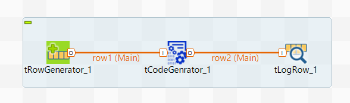
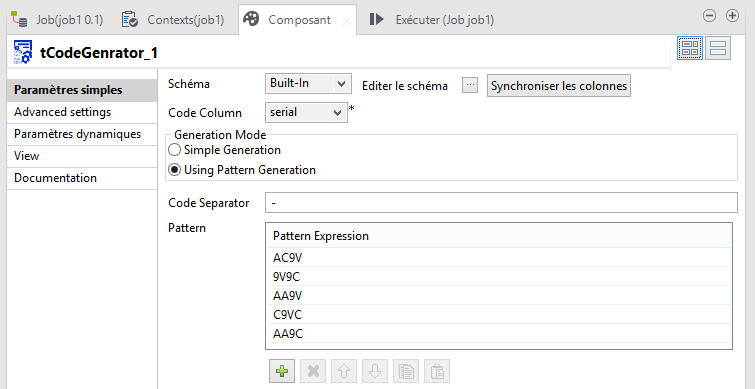
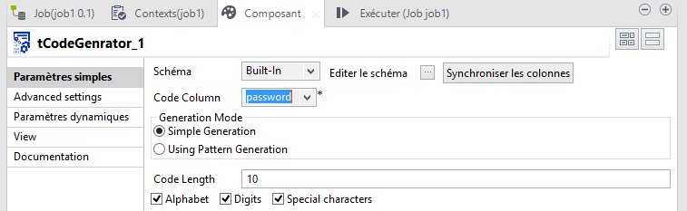

## tCodeGenerator

### Overview
to ganarate random codes there are 2 modes:
    1-simple mode (screenshot_1): ability to define code length and choose code composition(Digits,Alphabet,Special characters)
    2-using pattern mode (screenshot_2):ability to define multi pattern with separator(ex in case of serial number)
        This generates codes of a certain pattern. The pattern is defined by characters that correspond to a characterset:
        A = Alphabet (A, a, B, b , C, c ...)
    9 = Digits (0, 1, 2, ...)
    # = Special characters ($, %, &, ...)
    ! = Punctuation (!, ?, ...)
    [ = Brackets ([, ], (, ...)
    v = Vowels (a, e, i, ...)
    c = Consonants (b, c, d, ...)
    ? = Random from all characters above
    
### Details
Generate codes that can be used for passwords, promotional codes, sweepstakes, serial numbers and much more
### Images

#### Release Notes

##### 1.0 - 2016-10-02 14:26:23
Generate random codes that can be used for passwords, promotional codes, sweepstakes, serial numbers and much more.
2 generation modes:
*Simple Generation mode
*Using Pattern Generation
### Compatible
 -  1.1 (obsolete)
 -   2.0 (obsolete)
 -   2.1 (obsolete)
 -   2.2 (obsolete)
 -   2.3 (obsolete)
 -   2.4 (obsolete)
 -   3.0 (obsolete)
 -   3.1 (obsolete)
 -   3.2 (obsolete)
 -   4.0 (obsolete)
 -   4.1 (obsolete)
 -   4.2 (obsolete)
 -   5.0 (obsolete)
 -   5.1 (obsolete)
 -   5.2 (obsolete)
 -   5.3 (obsolete)
 -   5.4 (obsolete)
 -   5.5 (obsolete)
 -   5.6 (obsolete)
 -   1.2 (obsolete)
 -   6.0 (obsolete)
 -   6.1 (obsolete)
 -   6.2 (obsolete)