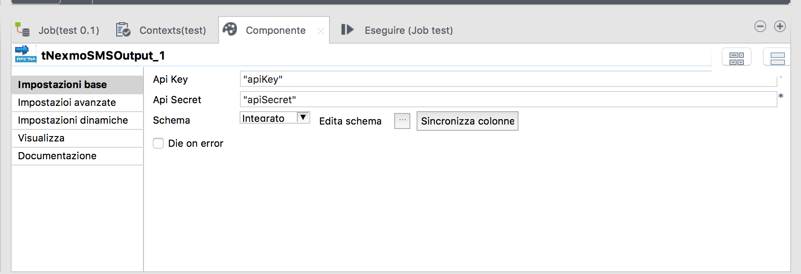

## tNexmoSMSOutput1

### Overview
Talend component to send an SMS using the Nexmo API (you need to have a Nexmo account)
### Details
Add SMS notify in a blink using Naxmo API (you have to have a nexmo account) and a tNexmoOutput component

### Images

### Resources
 * <a href=https://youtu.be/vzhPfv9SD80>Send SMS with tNexmoSMSOutput (YouTube Demo)</a>
 * <a href=https://gum.co/yNSir>Download the component from Gumroad</a>

#### Release Notes

##### 1.0 - 2016-10-15 07:04:48

### Compatible
 -  4.2 (obsolete)
 -   5.0 (obsolete)
 -   5.1 (obsolete)
 -   5.2 (obsolete)
 -   5.3 (obsolete)
 -   5.4 (obsolete)
 -   5.5 (obsolete)
 -   5.6 (obsolete)
 -   6.0 (obsolete)
 -   6.1 (obsolete)
 -   6.2 (obsolete)