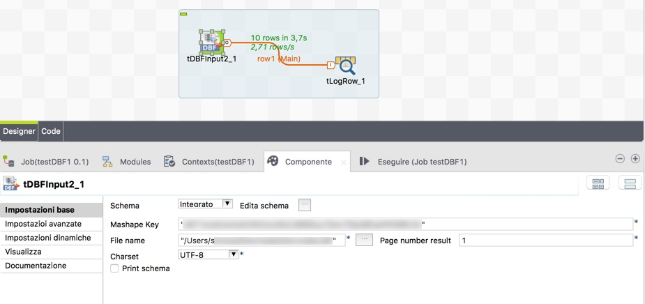
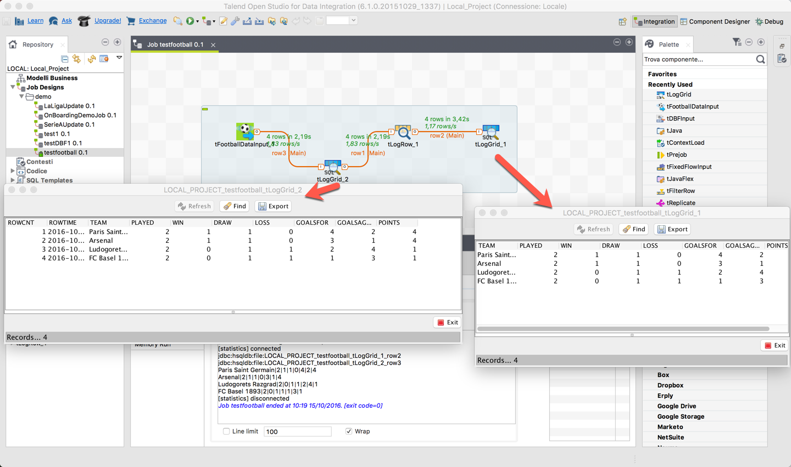

# bugshunter
  <nospam+simone.bianchi@gmail.com>

## <a href='./components/tDBFInput/readme.md'> tDBFInput</a>
 :warning: Compatibility not known

This component let you to read the following DBF files structure
-CLIPPER 5
-FoxBASE
-Dbase III
-Visual FoxPro
-dBASE IV
-FoxPro 2.x
-dBase V

## <a href='./components/tFootballData/readme.md'> tFootballData</a>
 :warning: Compatibility not known

This component let you to get tables, results, fixuters, statisitcs and more for the main european football leagues using different Mashape APIs in a trasparent mode.
More features, now available on the related Mashape APIs, will be integrated soon in future component releases.

To use the component you need a Mashape key, so you must have a Mashape account with a subscribed plan (free plans are availables) for the leagues you are interested in, the following ones are available..
-Premier League Live Scores
-La Liga Live Scores
-Bundesliga Live Scores
-Ligue1 Live Scores
-SerieA Live Scores
-Champions League
-Europa League
-Russian League Live Scores
-LigaNOS Live Scores
-Eredivisie Live Scores
-SerieA Essentials

## <a href='./components/tLogGrid/readme.md'> tLogGrid</a>
 :warning: Compatibility not known

Let you to inspect all data flowing in any point of your Talend job in a fancy GUI

## <a href='./components/tNexmoSMSOutput1/readme.md'> tNexmoSMSOutput1</a>
 :warning: Compatibility not known

Talend component to send an SMS using the Nexmo API (you need to have a Nexmo account)

