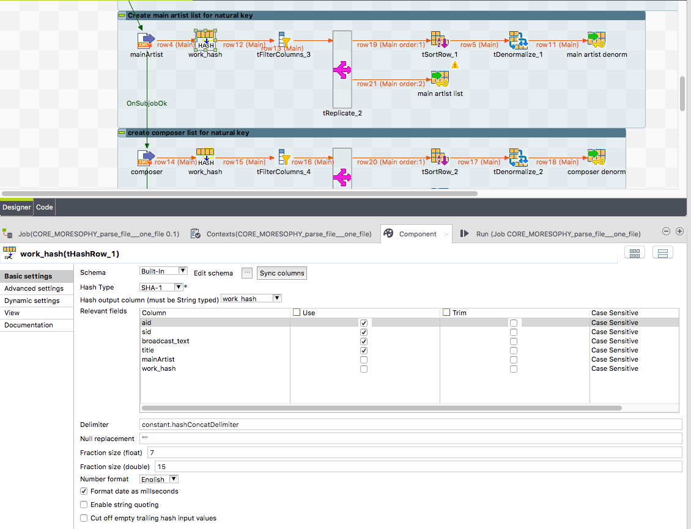

## tHashRow

### Overview
# Hash Keys for Data Vault
The hash key combines all business information which are essential to distinct an business object.
Such informations must be combined to one hash key.

You have to choose the hash key algorythm and the schema columns from the business key. Thats it.
### Details
* Multiple method to create the hash key value
* Very flexible to use the schema values to combine them to the hash key
* Can handle empty schema records (alternative hash key) instead of using only null
### Images

### Resources
 * <a href=https://github.com/jlolling/talendcomp_tHashRow>Source Code</a>

#### Release Notes

##### 1.5 - 2021-09-17 08:41:19
* Output encoding can be changed from HEX (prev. default) to Base64
##### 1.6 - 2022-05-16 16:24:05
* Bug in jet code fixed
### Compatible
 - 6.5 (retired)
 -  7.0 (retired)
 -  7.1 (retired)
 - 7.2
 - 7.3
 - 8.0