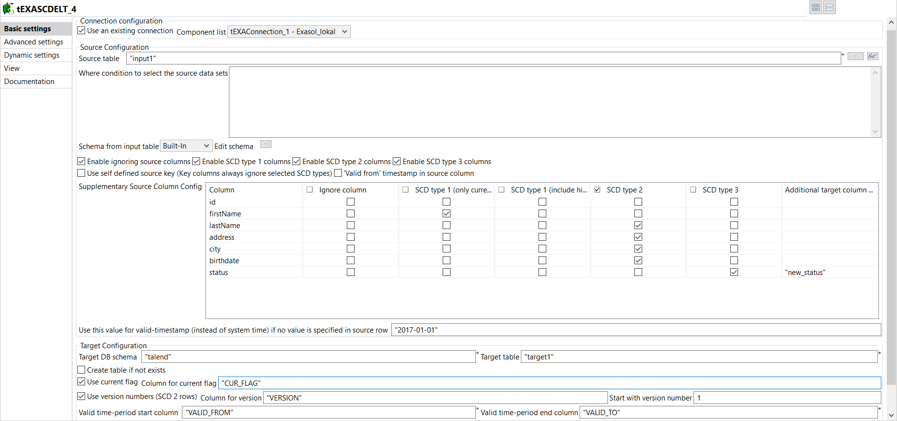

# cimt ag
  Als Beratungshaus mit umfangreicher technischer Lösungskompetenz liegt die Stärke insbesondere in der Integration von Anwendungssystemen. Dabei nutzt die cimt ag breites technologisches Wissen, um fachliche Problemstellungen zu lösen. Die Kernkompetenzen liegen hauptsächlich in den folgenden Themengebieten: SAP, Softwareentwicklung, Business Intelligence, Big Data und Business Process Management (BPM, SOA und ESB).
     <https://www.cimt-ag.de>
  <nospam+rouven.homann@cimt-ag.de>

## <a href='./components/tEXASCDELT/readme.md'> tEXASCDELT</a>
 :warning: Compatibility not known

tEXASCDELT creates and carries out SCD transformations from a source to a target table in an EXASOL database. 
This is an ELT component which means that all operations are executions of statements inside the database.

## <a href='./components/tHashRow/readme.md'> tHashRow</a>
 :white_check_mark: Compatible with Talend 7.x / 8.x 

# Hash Keys for Data Vault
The hash key combines all business information which are essential to distinct an business object.
Such informations must be combined to one hash key.

You have to choose the hash key algorythm and the schema columns from the business key. Thats it.

