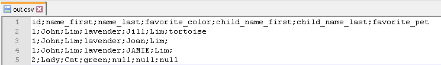
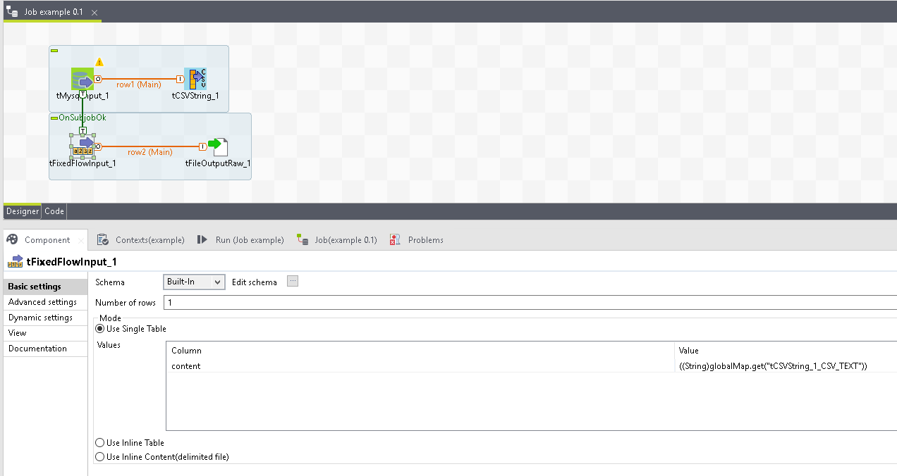
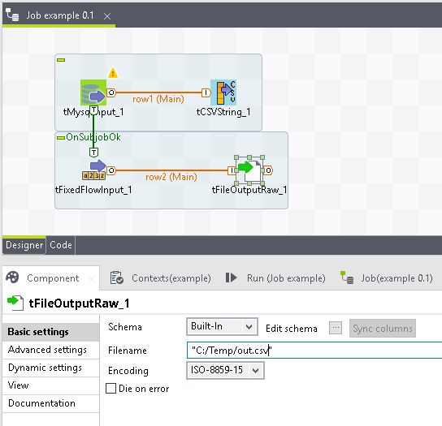

## tCSVString

### Overview
Converts all the rows and their columns to a single csv formated string. The csv string is not in the output row. Use the component property CSV_TEXT to retrieve the value.
### Details
multiple rows and multiple columns into a sinlge CSV
### Images

### Resources
 * <a href=https://github.com/dsietz/talend-tcsvstring>source code</a>

#### Release Notes

##### 1.0 - 2017-10-10 00:26:24

### Compatible
 -