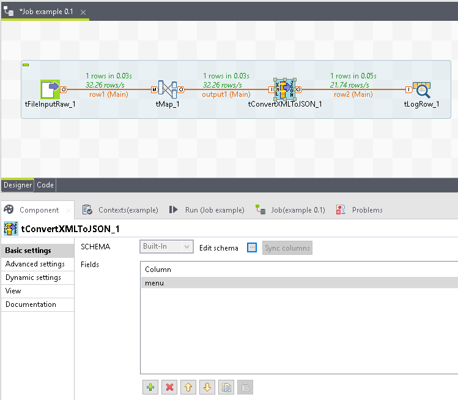
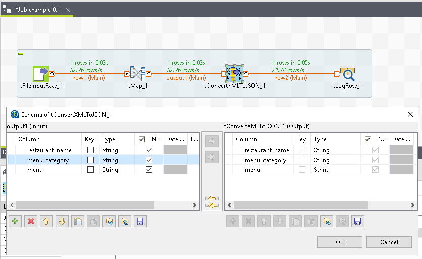
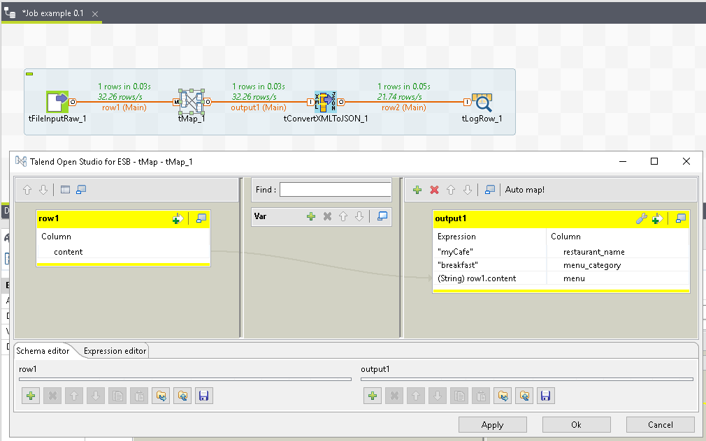

## tConvertXMLToJSON

### Overview
Converts a XML string to a JSON string.
### Details
Select which fields in the schema to convert and pass through the other fields.
### Images

### Resources
 * <a href=https://github.com/dsietz/talend-tconvertxmltojson>source code</a>

#### Release Notes

##### 1.0 - 2017-10-10 00:35:09

### Compatible
 -