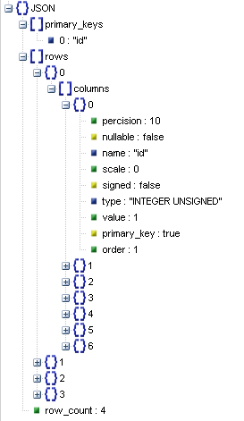
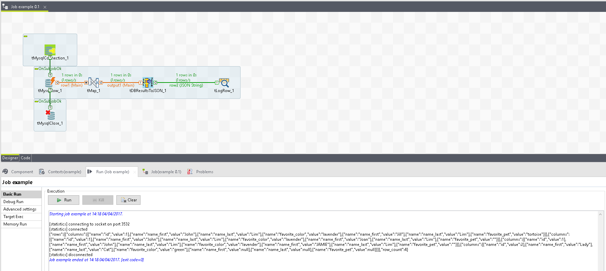
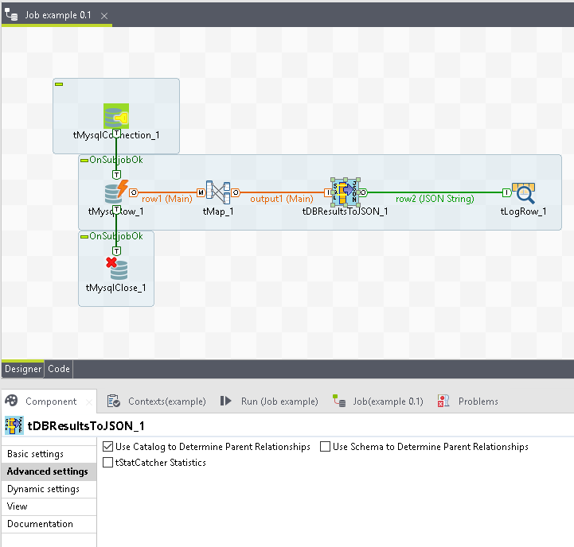
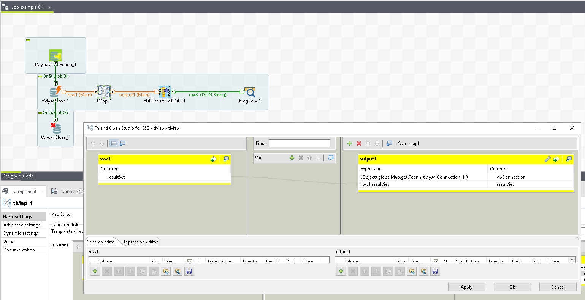

## tDBResultsToJSON

### Overview
Converts a database result set to a generic JSON string
### Details
Advanced Options
Set NULL placeholder
Set JSON to include data structure, values, or both
### Images

### Resources
 * <a href=https://github.com/dsietz/talend-tdbresultstojson>source code</a>

#### Release Notes

##### 1.0 - 2017-10-10 00:49:31

### Compatible
 -