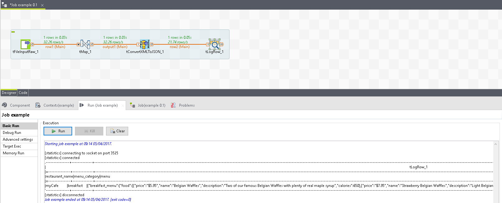

# dsietz
  <nospam+davidsietz@yahoo.com>

## <a href='./components/tConvertXMLToJSON/readme.md'> tConvertXMLToJSON</a>
 :warning: Compatibility not known

Converts a XML string to a JSON string.

## <a href='./components/tCSVString/readme.md'> tCSVString</a>
 :warning: Compatibility not known

Converts all the rows and their columns to a single csv formated string. The csv string is not in the output row. Use the component property CSV_TEXT to retrieve the value.

## <a href='./components/tDBResultsToJSON/readme.md'> tDBResultsToJSON</a>
 :warning: Compatibility not known

Converts a database result set to a generic JSON string

