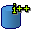

## tPostgresqlSequence

### Overview
This component is used to retrieve a value from a DB sequence in PostgreSQL. The function call used to get the sequence value is configurable, so for all intents and purposes this component simply calls a DB function that returns a long or integer for every input row, and puts that number in the specified output column (must be a Long or Integer column).

### Images

#### Release Notes

##### 0.1 - 2013-10-07 18:08:33
Initial revision of tPostgresqlSequence component
### Compatible
 -  5.3 (obsolete)
 -   5.4 (obsolete)
 -   6.0 (obsolete)
 -   6.1 (obsolete)
 -   6.2 (obsolete)