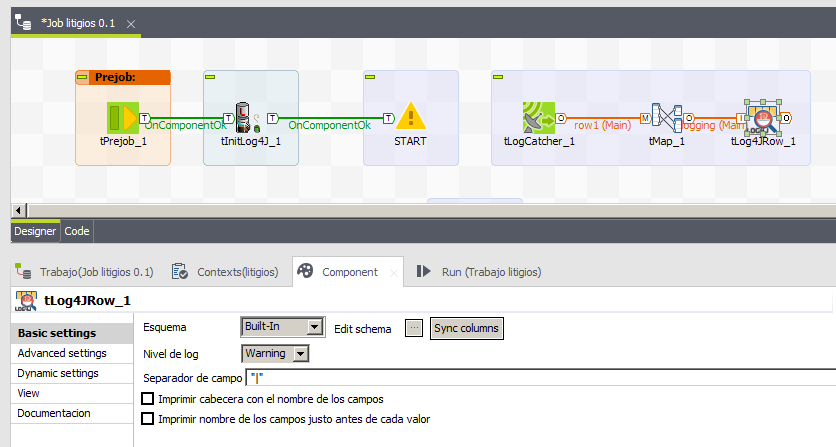

## tLog4jRow

### Overview
Simple LogRow component for log messages in loggers configured in log4j without write the content in the standard output.
### Details
This component has similiar features to the standard tLogRow:
- Print logs using the input schema
- Print headers
- Print schema column name in front of each value
- Use a specific logger for the message
- Use a specific log level
- Print start and end messages
### Images

#### Release Notes

##### 0.1 - 2016-02-05 08:22:57

##### 0.2 - 2016-02-16 14:22:25
In this version, each log row could start with the label of the component instead of the unique name.
### Compatible
 -  5.0 (obsolete)
 -   5.1 (obsolete)
 -   5.2 (obsolete)
 -   5.3 (obsolete)
 -   5.4 (obsolete)
 -   5.5 (obsolete)
 -   5.6 (obsolete)
 -   6.0 (obsolete)
 -   6.1 (obsolete)
 -   6.2 (obsolete)