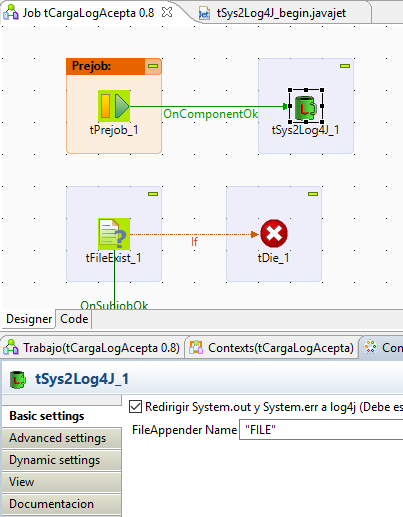
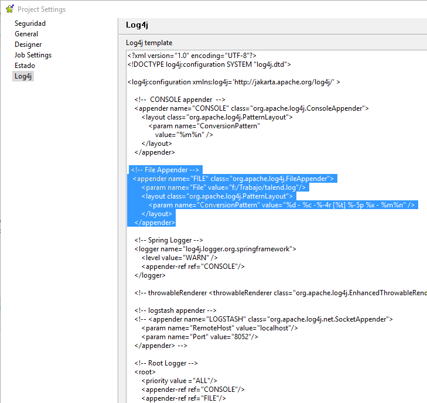

## tSys2Log4J

### Overview
In production mode (job standalone) system.out.print and system.err.print not redirected to log4j 
losing a lot of data for Error Analysis 
This component redirect all system to FileAppender in log4j
### Details
A simple component for redirect output to log4j FileAppeder
### Images

### Install Instructions
Requires Log4j working, and a FileAppender defined on log4.xml

#### Release Notes

##### 0.1 - 2016-06-22 19:25:39
beta release
initial version
### Compatible
 -  6.0 (obsolete)
 -   6.1 (obsolete)