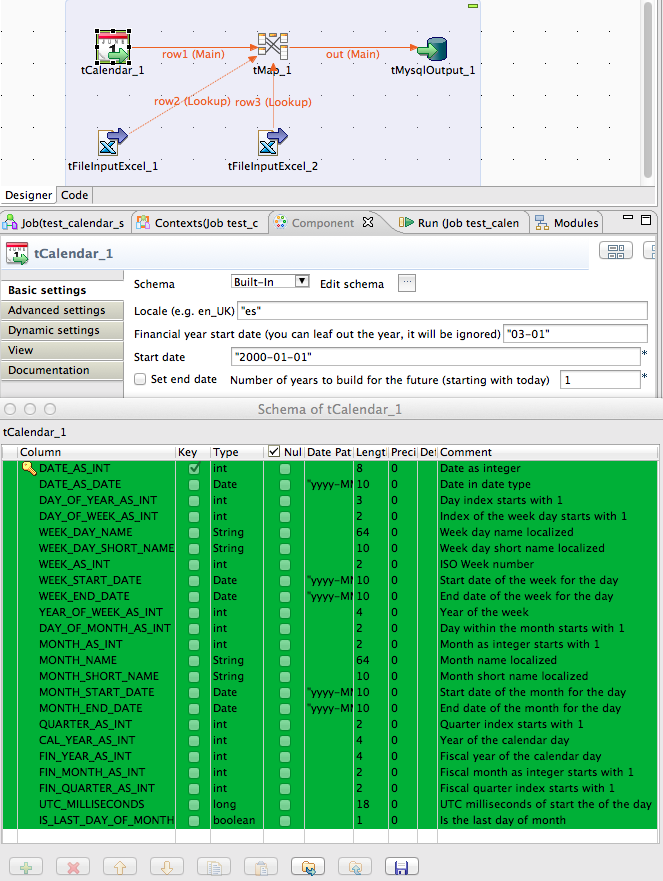

## tCalendar

### Overview
Data warehouses needs a date dimension and this component creates the most of the needed data (also fully localised).
The schema of this component is fully commented.

### Details
* creates all possible date categories like day, week, month, year, quarter
* builds integer id for all categories to support a table as dimension
* supports different years (year for the current week and a financial year)
* build automatically a configurable amount of days in the future. 
### Images

### Install Instructions
After update of this component you have to remove the component from the job and add it again, otherwise the new schema columns will not appears.
This is not a fault of the component, this is a systematical problem in Talend.

#### Release Notes

##### 1.1 - 2014-07-01 08:18:32
republished
##### 1.2 - 2014-09-17 18:59:44
* Added some additional schema columns:
    IS_LAST_DAY_OF_MONTH
    FIN_MONTH_AS_INT
    FIN_QUARTER_AS_INT
    UTC_MILLISECONDS
* Label for years to build is changed a bit to make it clear, the years starts always from the current date.
### Compatible
 -  5.1 (obsolete)
 -   5.2 (obsolete)
 -   5.3 (obsolete)
 -   5.4 (obsolete)
 -   5.5 (obsolete)
 -   5.6 (obsolete)
 -   6.0 (obsolete)
 -   6.1 (obsolete)
 -   6.2 (obsolete)
 -   6.3 (obsolete)
 -   6.4 (obsolete)
 -  6.5 (retired)
 -  7.0 (retired)
 -  7.1 (retired)