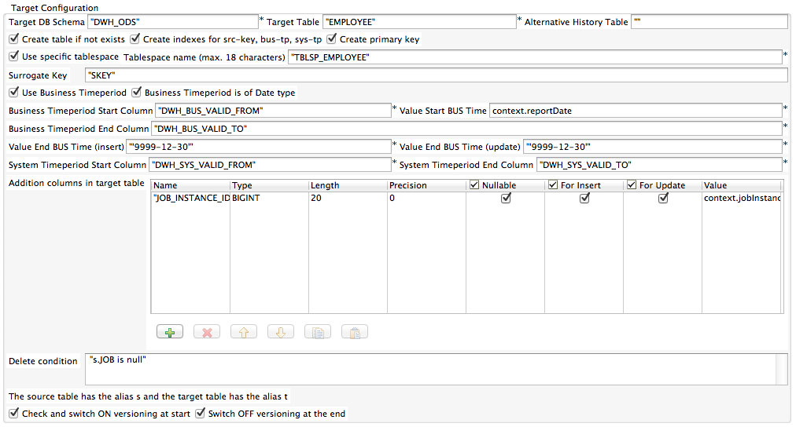

## tDB2TemporalMergeELT+tDB2TemporalDeleteELT

### Overview
This package contains 2 components:
tDB2TemporalMergeELT
tDB2TemporalDeleteELT

These components supports the ELT usage of the IBM DB2 temporal tables, introduced with the release 10.1 of the IBM DB2 database.

Please refer to the linked documentation!

tDB2TemporalMergeELT create and updates temporal tables.
tDB2TemporalDeleteELT performs temporal deletes.
Temporal tables are a native Slowly Changing Dimension Type 2 implementation (with bi-temporal means you have a business time period and a system time period for the validity of your data).

Documentation for the tDB2TemporalMergeELT: http://jan-lolling.de/talend/components/help/tDB2TemporalMergeELT.pdf
Documentation for the tDB2TemporalDeleteELT: http://jan-lolling.de/talend/components/help/tDB2TemporalDeleteELT.pdf

### Details
This component is a SQL code generator for everything whats necessary to work with temporal tables.
Create the table and check its status
Merge the data into the table in the ELT way.
### Images

### Resources
 * <a href=http://jan-lolling.de/talend/components/help/tDB2TemporalDeleteELT.pdf>Documentation Delete Component</a>
 * <a href=http://jan-lolling.de/talend/components/help/tDB2TemporalMergeELT.pdf>Documentation Merge Componente</a>

#### Release Notes

##### 1.8 - 2014-07-01 06:16:55
republished
Can delete (logical with a business time period) data based on a additional delete condition.
##### 2.1 - 2014-09-09 12:07:04
Target table will be created as normal table and converted after creation into a temporal table.
Primary key can also be created if no business time period is in use.
History table can be configured for append on mode.
##### 2.2 - 2014-09-30 21:47:51
Bug fixed: Business time period as timestamp does not work, only a date will be written as business time stamp, the time was truncated.
Enhancement: the log output shows the statement parameter as text in a way which is directly usable in SQL. 
##### 3.0 - 2014-12-02 13:39:03
New component added tDB2TemporalDeleteELT
Both components use the same library.
tDB2TemporalMergeELT is functional unchanged.
##### 3.1 - 2015-02-25 10:53:58
tDB2TemporalDeleteELT improved to be able to select the reference records
### Compatible
 -  5.1 (obsolete)
 -   5.2 (obsolete)
 -   5.3 (obsolete)
 -   5.4 (obsolete)
 -   5.5 (obsolete)
 -   5.6 (obsolete)
 -   6.0 (obsolete)
 -   6.1 (obsolete)
 -   6.2 (obsolete)
 -   6.3 (obsolete)
 -   6.4 (obsolete)
 -  6.5 (retired)
 -  7.0 (retired)
 -  7.1 (retired)