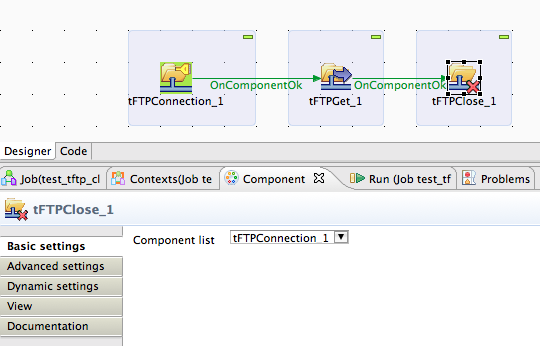

## tFTPClose

### Overview
Closes a FTP connection (also SFTP the other supported connection types).
Embedded jobs connection to a FTP/SFTP/FTPS Server without closing them can cause serious problems. 
This component is designed to detect the kind of connection beased on the settings of the tFTPConnection component and builds the necessary code to close it correctly.
### Details
* Closes a FTP/SFTP/FTPS connection created by tFTPConnection component
* Avoids a leak of possible connections
### Images

#### Release Notes

##### 1.1 - 2014-06-29 12:32:25
republished
### Compatible
 -  5.1 (obsolete)
 -   5.4 (obsolete)
 -   5.5 (obsolete)
 -   5.6 (obsolete)