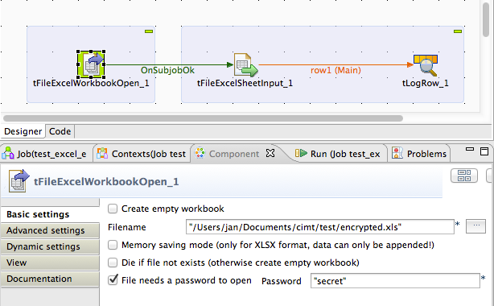

## tFileExcel-Components

### Overview
This component open an existing Excel workbook or creates a new one. 
This component is the basis for all other tFileExcel* component.
It uses the latest Apache POI API 3.12 final and recognise the kind of workbook by the file name, it is not necessary to decide at start which kind of document you want to load.
The component has an option to use the xml parser already loaded by the JDK or Runtime or the parser shipped with the component (advanced settings). 
This should solve incompatibility problems.
### Details
* Open an Excel file
* Automatically detects the file format
* Creates an Excel workbook
* Can write very large files using a streaming mode (Memory saving mode)
### Images

### Resources
 * <a href=https://github.com/jlolling/talendcomp_tFileExcel>Source Code on Github</a>

#### Release Notes

##### 6.3 - 2014-06-29 10:11:44
republished
##### 6.5 - 2014-11-15 18:58:07
Provides the function to use cached values in case of evaluating formulas fails.
Bug fixed: Referenced cells will be written correctly if the cell reference does not contains the sheet name, but the target sheet is provided separately as name or index.
The component dos not ship the xml parser anymore because such parsers are already part of the JDK or runtime containers. This should solve incompatibility problems
##### 6.6 - 2014-11-17 21:11:42
Option to use the default xml parser.
true=use the parser shipped with the JDK
false=use the parser shipped with the component
##### 6.7 - 2015-03-04 22:49:39
Update library for improved handling of empty rows for the component tFileExcelSheetInput.
Updated Apache-POI API release 3.11 used.
### Compatible
 -  5.1 (obsolete)
 -   5.2 (obsolete)
 -   5.3 (obsolete)
 -   5.4 (obsolete)
 -   5.5 (obsolete)
 -   5.6 (obsolete)
 -   6.0 (obsolete)
 -   6.1 (obsolete)
 -   6.2 (obsolete)